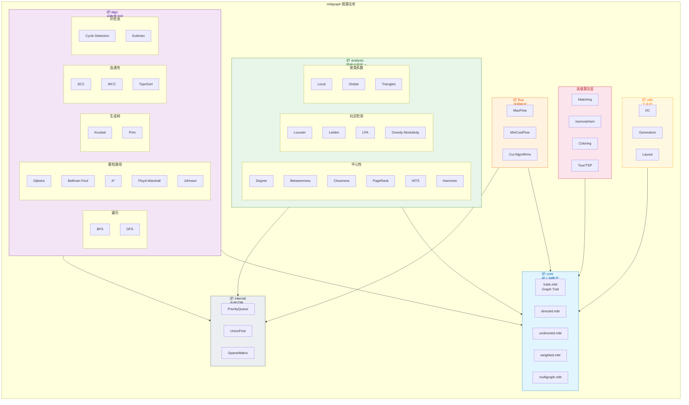
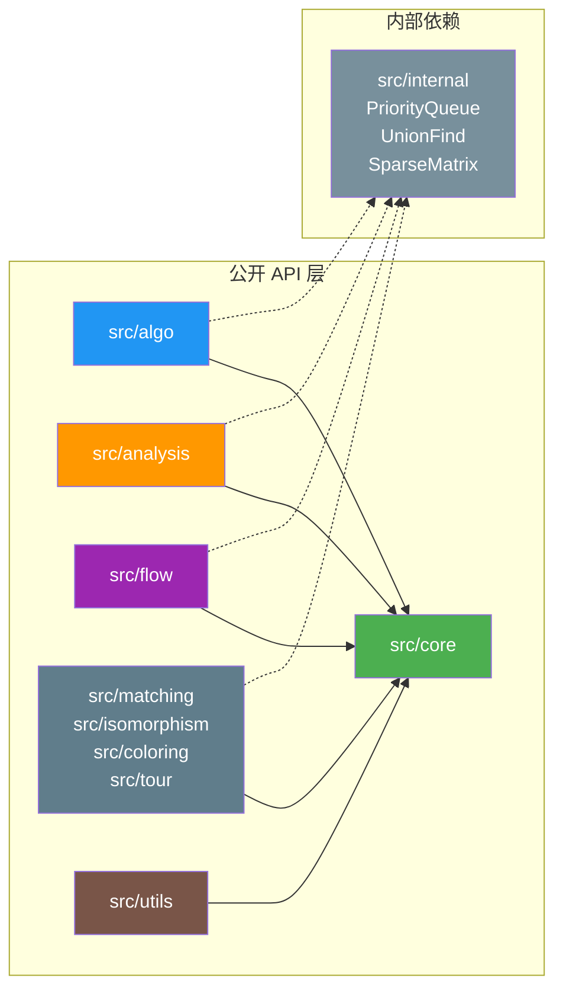
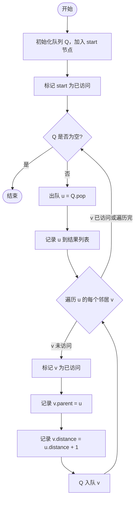
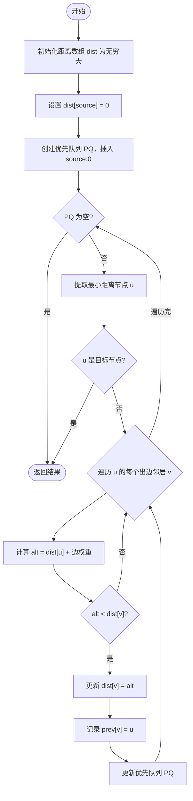
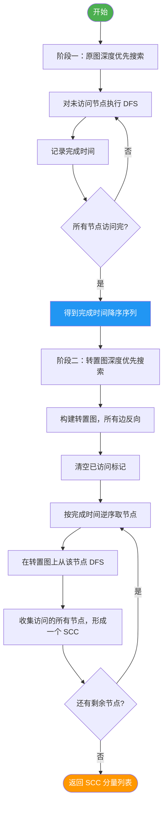
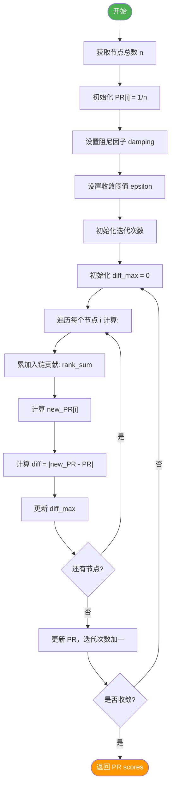
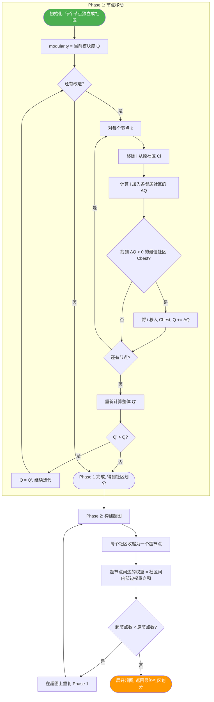
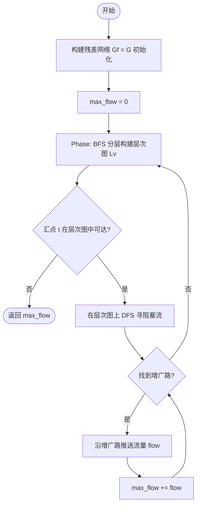

# 🏗️ mbtgraph 图算法库架构设计

> **项目定位**: MoonBit 生态的高性能、类型安全、模块化**图算法库 (Library/Package)**  
> **基于调研**: 5 大语言 8 个主流图算法库的深度分析

---

## 📋 设计原则与定位

### 核心定位

```
┌─────────────────────────────────────────────────────┐
│                  mbtgraph                          │
│            (MoonBit Graph Algorithm Library)        │
│                                                     │
│   ✅ 纯算法库 - 不包含应用层                         │
│   ✅ 可被其他 MoonBit 项目依赖                        │
│   ✅ 编译到 wasm/js/native 多目标                    │
└─────────────────────────────────────────────────────┘
```

### 设计理念

| 原则 | 说明 |
|------|------|
| **库优先** | 纯算法包设计，不包含 CLI/GUI 应用 |
| **Trait 驱动** | 通过 trait 定义抽象接口，支持多种图实现 |
| **泛型安全** | 利用 MoonBit 泛型系统保证编译期类型检查 |
| **模块解耦** | 清晰的包边界，按功能域划分，最小化依赖 |
| **渐进式 API** | 从高层便捷函数到底层可定制组件 |

### 架构参考来源

| 参考库 | 借鉴要点 |
|--------|----------|
| **NetworkX** | 模块化组织、全面的算法分类体系 |
| **petgraph (Rust)** | 多图类型、Index-based 节点标识 |
| **JGraphT (Java)** | 接口驱动架构、类型安全的 API 设计 |
| **LEMON (C++)** | 高性能流算法实现策略 |
| **gonum/graph (Go)** | 网络分析工具集的组织方式 |

---

## 📐 项目目录结构 (纯库版)

```
mbtgraph/
├── moon.mod.json                    # 模块元数据
├── LICENSE                          # Apache-2.0
├── README.mbt.md                    # 库说明文档
│
├── src/                             # ════════ 核心源码 ════════
│   │
│   ├── core/                        # 📦 核心数据结构与抽象
│   │   ├── moon.pkg                 # 包配置与导出
│   │   ├── types.mbt                # 基础类型定义 (NodeId, EdgeId)
│   │   ├── traits.mbt               # 核心 Trait 定义 (Graph, MutableGraph...)
│   │   ├── directed.mbt             # 有向图实现
│   │   ├── undirected.mbt           # 无向图实现
│   │   ├── weighted.mbt             # 加权图扩展 trait
│   │   └── multigraph.mbt           # 多重图支持
│   │
│   ├── algo/                        # 📦 经典图论算法
│   │   ├── moon.pkg                 # 包配置
│   │   ├── traverse/                # 遍历算法
│   │   │   ├── moon.pkg
│   │   │   ├── bfs.mbt              # 广度优先搜索
│   │   │   └── dfs.mbt              # 深度优先搜索
│   │   │
│   │   ├── shortest_path/           # 最短路径算法
│   │   │   ├── moon.pkg
│   │   │   ├── dijkstra.mbt         # Dijkstra (非负权)
│   │   │   ├── bellman_ford.mbt     # Bellman-Ford (支持负权)
│   │   │   ├── astar.mbt            # A* 启发式搜索
│   │   │   ├── floyd_warshall.mbt   # Floyd-Warshall (全对)
│   │   │   └── johnson.mbt          # Johnson (稀疏图全对)
│   │   │
│   │   ├── spanning_tree/           # 最小生成树
│   │   │   ├── moon.pkg
│   │   │   ├── kruskal.mbt          # Kruskal 算法
│   │   │   └── prim.mbt             # Prim 算法
│   │   │
│   │   ├── connectivity/            # 连通性分析
│   │   │   ├── moon.pkg
│   │   │   ├── scc.mbt              # 强连通分量 (Kosaraju / Tarjan)
│   │   │   ├── wcc.mbt              # 弱连通分量
│   │   │   ├── biconnectivity.mbt   # 双连通 (割点 + 桥)
│   │   │   └── toposort.mbt         # 拓扑排序
│   │   │
│   │   └── cycle/                   # 环检测
│   │       ├── moon.pkg
│   │       ├── detection.mbt        # 有向环检测
│   │       └── eulerian.mbt         # 欧拉路径/回路
│   │
│   ├── analysis/                    # 📦 网络科学分析 ⭐ 差异化优势
│   │   ├── moon.pkg                 # 包配置
│   │   ├── centrality/              # 中心性指标
│   │   │   ├── moon.pkg
│   │   │   ├── degree.mbt           # 度中心性
│   │   │   ├── betweenness.mbt      # 介数中心性
│   │   │   ├── closeness.mbt        # 紧密中心性
│   │   │   ├── pagerank.mbt         # PageRank
│   │   │   ├── hits.mbt             # HITS (Hub-Authority)
│   │   │   └── harmonic.mbt         # 调和中心性
│   │   │
│   │   ├── community/               # 社区检测算法
│   │   │   ├── moon.pkg
│   │   │   ├── louvain.mbt          # Louvain 算法
│   │   │   ├── leiden.mbt           # Leiden 算法 (Louvain 改进)
│   │   │   ├── label_propagation.mbt # 标签传播 (LPA)
│   │   │   ├── greedy_modularity.mbt # 贪心模块度优化
│   │   │   └── metrics.mbt          # 模块度计算
│   │   │
│   │   └── clustering/              # 聚类系数
│   │       ├── moon.pkg
│   │       ├── local.mbt            # 局部聚类系数
│   │       ├── global.mbt           # 全局聚类系数 (传递性)
│   │       └── triangles.mbt        # 三角形计数
│   │
│   ├── flow/                        # 📦 流网络算法
│   │   ├── moon.pkg                 # 包配置
│   │   ├── max_flow/                # 最大流
│   │   │   ├── moon.pkg
│   │   │   ├── ford_fulkerson.mbt   # Ford-Fulkerson 方法
│   │   │   ├── edmonds_karp.mbt     # Edmonds-Karp (BFS 增广路)
│   │   │   ├── dinic.mbt            # Dinic 分层图算法
│   │   │   └── push_relabel.mbt     # Push-Relabel (最高标号)
│   │   │
│   │   ├── min_cost_flow/           # 最小费用流
│   │   │   ├── moon.pkg
│   │   │   ├── successive_shortest.mbt # 连续最短增广路
│   │   │   └── cycle_canceling.mbt  # 消圈算法
│   │   │
│   │   └── cut/                     # 割算法
│   │       ├── moon.pkg
│   │       ├── stoer_wagner.mbt     # Stoer-Wagner 全局最小割
│   │       └── edge_connectivity.mbt # 边/点连通度
│   │
│   ├── matching/                    # 📦 匹配算法
│   │   ├── moon.pkg
│   │   ├── greedy.mbt               # 贪心匹配 (近似, O(E))
│   │   ├── maximum_cardinality.mbt  # 最大基数匹配 (Edmonds' Blossom)
│   │   ├── maximum_weighted.mbt     # 最大权匹配
│   │   └── bipartite.mbt            # 二分图匹配特化
│   │
│   ├── isomorphism/                 # 📦 同构检测
│   │   ├── moon.pkg
│   │   ├── vf2.mbt                  # VF2 子图同构 (精确)
│   │   ├── color_refinement.mbt     # 颜色细化 (快速近似判定)
│   │   └── tree_isomorphism.mbt     # 树同构 (AHU 线性算法)
│   │
│   ├── coloring/                    # 📦 图着色
│   │   ├── moon.pkg
│   │   ├── greedy.mbt               # 贪心着色 (DSATUR/LFI/SL 策略)
│   │   ├── dsatur.mbt               # DSATUR 着色
│   │   └── exact.mbt                # 精确最优着色 (回溯+分支限界)
│   │
│   └── tour/                        # 📦 回路与游历
│       ├── moon.pkg
│       ├── hamiltonian.mbt          # 哈密顿回路/路径 (NP-hard, 近似)
│       ├── tsp/                     # TSP 近似算法集
│       │   ├── two_approx.mbt       # 2-近似
│       │   ├── christofides.mbt     # Christofides 1.5-近似
│       │   └── nearest_neighbor.mbt # 最近邻启发式
│       └── eulerian.mbt            # 欧拉回路 (Hierholzer)
│
├── utils/                           # ════════ 辅助工具 ════════
│   ├── moon.pkg                     # 包配置
│   ├── io/                          # 序列化与反序列化
│   │   ├── moon.pkg
│   │   ├── dot.mbt                  # Graphviz DOT 格式读写
│   │   ├── graphml.mbt              # GraphML 格式
│   │   ├── json.mbt                 # JSON 格式
│   │   └── csv.mbt                  # CSV 边列表格式
│   │
│   ├── generators/                  # 图生成器
│   │   ├── moon.pkg
│   │   ├── classic.mbt              # 经典图 (完全图 K_n, 环 C_n, 星 S_n, Petersen...)
│   │   ├── random_graphs.mbt        # 随机图模型 (G(n,p), G(n,m), BA, WS, ER...)
│   │   └── special.mbt              # 特殊构造图 (Kneser, Hypercube, Grid...)
│   │
│   └── layout/                      # 布局算法 (用于可视化输出坐标)
│       ├── moon.pkg
│       ├── force_directed.mbt       # 力导向布局 (Fruchterman-Reingold)
│       ├── circular.mbt             # 环形布局
│       └── hierarchical.mbt         # 层次布局 (Sugiyama)
│
├── internal/                        # ════════ 内部基础设施 ════════
│   ├── moon.pkg
│   ├── priority_queue.mbt           # 可配置优先队列 (二叉堆/斐波那契堆/配对堆)
│   ├── union_find.mbt              # 并查集 (用于 Kruskal MST / 连通性)
│   ├── disjoint_set.mbt            # 不相交集扩展
│   └── sparse_matrix.mbt           # 稀疏矩阵 (CSR/CSC 格式, 用于代数算法)
│
├── test/                           # ════════ 测试套件 ════════
│   ├── moon.pkg
│   ├── fixtures/                    # 测试数据文件
│   │   ├── karate_club.dot          # Karate Club 社交网络 (34节点)
│   │   ├── drosophila_ppi.dot      # 果蝇蛋白质互作网络
│   │   ├── small_test.dot           # 小型人工测试图
│   │   └── large_random_10k.dot    # 大规模随机图 (10K节点, 性能基准)
│   │
│   ├── core_test.mbt                # core 包单元测试
│   ├── algo_test.mbt                # algo 包单元测试
│   ├── analysis_test.mbt            # analysis 包单元测试
│   ├── flow_test.mbt                # flow 包单元测试
│   └── integration_test.mbt         # 跨包集成测试场景
│
└── docs/                           # ════════ 文档 ════════
    ├── reference/                   # 调研报告 (8份已完成 ✓)
    ├── architecture/                # 本文档所在目录
    │   └── project_structure_design.md
    └── api/                         # API 文档 (自动生成或手写)
```

---

## 🗺️ 架构总览图 (Mermaid)



---

## 🔗 模块依赖关系图



---

## 🎯 核心模块详细设计

### 1️⃣ src/core - 核心数据结构

#### 1.1 类型系统

```
基础标识符类型:
┌─────────────────────────────────────────────────┐
│  NodeId = Int64                                │  ← 节点唯一标识 (支持 >2^32 节点)
│  EdgeId = Int64                                │  ← 边唯一标识
│                                                 │
│  struct EdgeKey {                               │  ← 无向边去重键
│    from: NodeId                                 │
│    to: NodeId                                   │
│  }                                              │
└─────────────────────────────────────────────────┘
```

#### 1.2 核心 Trait 层次

```
                    ┌─────────────────┐
                    │     Graph       │  ← 最小接口: 查询操作
                    │  [N, E]          │
                    ├─────────────────┤
                    │ node_count()    │
                    │ edge_count()    │
                    │ contains_node() │
                    │ contains_edge() │
                    │ neighbors()     │
                    └────────┬────────┘
                             │
            ┌────────────────┼────────────────┐
            ▼                ▼                ▼
    ┌───────────────┐ ┌──────────────┐ ┌──────────────┐
    │ MutableGraph  │ │WeightedGraph │ │DirectedGraph │
    │ [N,E]:Graph   │ │ [N,E]:Graph  │ │ [N,E]:Graph  │
    ├───────────────┤ ├──────────────┤ ├──────────────┤
    │ add_node()    │ │ edge_weight()│ │ successors() │
    │ add_edge()    │ │ total_weight│ │ predecessors│
    │ remove_node() │ └──────┬───────┘ │ reverse()    │
    │ remove_edge() │        │         └──────┬───────┘
    │ set_weight()  │        ▼                │
    └───────────────┘ ┌──────────────┐        │
                      │UndirectedGraph│◄───────┘
                      │ [N,E]:Graph   │
                      ├──────────────┤
                      │ degree()      │
                      └──────────────┘
```

#### 1.3 数据结构选择指南

| 图特征 | 推荐实现 | 内部存储 | 适用规模 |
|--------|----------|----------|----------|
| 稀疏有向图 | `DirectedGraph` | 邻接表 + HashMap | V < 10M, E/V < 20 |
| 稠密有向图 | `DirectedDenseGraph` | 邻接矩阵 | V < 10K, E/V > 100 |
| 稀疏无向图 | `UndirectedGraph` | 邻接表 + HashSet | V < 10M |
| 只读静态图 | `StaticGraph` | CSR 格式 | V > 1M, 批量查询 |
| 多重图 | `MultiGraph` | 邻接表 + Vec | 允许平行边 |

---

### 2️⃣ src/algo - 经典算法 (伪代码 + 流程图)

#### 2.1 BFS 广度优先搜索

**算法流程图**:



**算法伪代码**:

```
算法: BREADTH_FIRST_SEARCH(G, source)
输入: 图 G, 起始节点 source
输出: BFSResult { discovered_order[], distance[], parent[] }

BEGIN
  初始化空队列 Q
  初始化 visited = ∅
  初始化 result.distance[source] = 0
  将 source 加入 Q
  标记 visited.add(source)

  WHILE Q 非空 DO
    u ← Q.pop_front()
    result.discovered_order.append(u)

    FOR EACH v ∈ G.neighbors(u) DO
      IF v ∉ visited THEN
        visited.add(v)
        result.parent[v] ← u
        result.distance[v] ← result.distance[u] + 1
        Q.push_back(v)
      END IF
    END FOR
  END WHILE

  RETURN result
END
```

**复杂度**: 时间 O(V+E), 空间 O(V)

---

#### 2.2 Dijkstra 最短路径

**算法流程图**:



**算法伪代码**:

```
算法: DIJKSTRA(G, source, target?)
输入: 加权图 G (权重 ≥ 0), 源节点 source, 可选目标 target
输出: ShortestPathResult { distances[], predecessors[] } 或 Error

BEGIN
  FOR EACH node v ∈ G.nodes() DO
    dist[v] ← ∞
    prev[v] ← NIL
  END FOR
  dist[source] ← 0

  创建最小优先队列 PQ
  PQ.insert(source, 0)

  WHILE PQ 非空 DO
    (u, u_dist) ← PQ.extract_min()

    IF target ≠ NULL AND u == target THEN
      BREAK  // 提前终止
    END IF

    FOR EACH v ∈ G.successors(u) DO
      alt ← u_dist + G.weight(u, v)

      IF alt < dist[v] THEN
        dist[v] ← alt
        prev[v] ← u
        IF v ∈ PQ THEN
          PQ.decrease_key(v, alt)
        ELSE
          PQ.insert(v, alt)
        END IF
      END IF
    END FOR
  END WHILE

  RETURN { distances: dist, predecessors: prev }
END
```

**复杂度**: 时间 O((V+E) log V) 二叉堆, O(V²) 斐堆; 空间 O(V)

---

#### 2.3 Kosaraju 强连通分量 (SCC)

**算法流程图**:



**算法伪代码**:

```
算法: KOSARAJU_SCC(G)
输入: 有向图 G
输出: SCCResult { components[], component_id[], count }

BEGIN
  // ========== Phase 1: 计算完成时间 ==========
  visited ← ∅
  finish_order ← []  // 空 list

  PROCEDURE DFS1(v)
    visited.add(v)
    FOR EACH u ∈ G.successors(v) DO
      IF u ∉ visited THEN
        DFS1(u)
      END IF
    END FOR
    finish_order.prepend(v)  // 记录完成时间 (前插)
  END PROCEDURE

  FOR EACH vertex v ∈ G.vertices() DO
    IF v ∉ visited THEN
      DFS1(v)
    END IF
  END FOR

  // ========== Phase 2: 在转置图上按逆序 DFS ==========
  GT ← G.transpose()  // 反转所有边方向
  visited.clear()
  components ← []
  component_id_map ← {}

  PROCEDURE DFS2(v, current_component)
    current_component.append(v)
    component_id_map[v] ← components.length - 1
    FOR EACH u ∈ GT.successors(v) DO  // 原 predecessors
      IF u ∉ visited THEN
        DFS2(u, current_component)
      END IF
    END FOR
  END PROCEDURE

  FOR EACH v ∈ finish_order (从后向前) DO
    IF v ∉ visited THEN
      new_component ← []
      DFS2(GT, v, new_component)
      components.append(new_component)
    END IF
  END FOR

  RETURN {
    components: components,
    component_id: component_id_map,
    count: components.length
  }
END
```

**复杂度**: 时间 O(V+E) 两遍 DFS; 空间 O(V)

---

#### 2.4 Kruskal 最小生成树

**算法伪代码**:

```
算法: KRUSKAL_MST(G)
输入: 无向加权连通图 G
输出: MST edges[] 和 total_weight

BEGIN
  edges ← G.all_edges()
  SORT edges BY weight 升序

  uf ← NEW UnionFind(G.node_count())
  mst_edges ← []
  total_weight ← 0

  FOR EACH edge(u, v, w) ∈ edges (按序) DO
    IF uf.find(u) ≠ uf.find(v) THEN  // 不在同一集合
      uf.union(u, v)
      mst_edges.append(edge)
      total_weight += w

      IF mst_edges.length == G.node_count() - 1 THEN
        BREAK  // 已选够 n-1 条边
      END IF
    END IF
  END FOR

  RETURN { edges: mst_edges, weight: total_weight }
END
```

**复杂度**: 时间 O(E log E) 排序主导; 空间 O(V)

---

### 3️⃣ src/analysis - 网络分析 (差异化核心!)

#### 3.1 PageRank 迭代算法

**算法流程图**:



**算法伪代码**:

```
算法: PAGERANK(G, damping=0.85, tolerance=1e-6, max_iter=100)
输入: 有向/无向图 G
输出: PageRankResult { scores[], iterations, converged }

BEGIN
  n ← G.node_count()
  PR[1..n] ← 1/n  // 初始均匀分布

  FOR iter = 1 TO max_iter DO
    max_diff ← 0
    new_PR[1..n] ← 0

    FOR i = 1 TO n DO
      rank_in_sum ← 0
      FOR EACH j ∈ G.predecessors(i) DO
        rank_in_sum += PR[j] / G.out_degree(j)
      END FOR
      new_PR[i] ← (1-damping)/n + damping × rank_in_sum

      diff ← |new_PR[i] - PR[i]|
      max_diff ← MAX(max_diff, diff)
    END FOR

    PR ← new_PR  // 更新

    IF max_diff < tolerance THEN
      RETURN { scores: PR, iterations: iter, converged: true }
    END IF
  END FOR

  RETURN { scores: PR, iterations: max_iter, converged: false }
END
```

**收敛性**: 保证收敛 (damping < 1 时); 实际 10-20 次迭代通常足够

---

#### 3.2 Louvain 社区检测

**算法流程图 (两阶段迭代)**:



**算法伪代码 (Phase 1 核心)**:

```
算法: LOUVAIN(G)
输入: 加权无向图 G
输出: CommunityResult { communities[], membership[], modularity }

BEGIN
  // ---- 初始化 ----
  FOR EACH node v ∈ V DO
    community[v] ← v  // 每个节点自成一社区
  END FOR
  Q ← calculate_modularity(G, community)
  improved ← true

  // ---- Phase 1 主循环: 节点局部移动 ----
  WHILE improved DO
    improved ← false
    gain_this_round ← 0

    FOR EACH node v ∈ V (随机顺序) DO
      original_comm ← community[v]
      best_delta_q ← 0
      best_comm ← original_comm

      // 尝试将 v 移到邻居所在的社区
      neighbor_comms ← UNIQUE(community[u] : u ∈ neighbors(v))

      FOR EACH comm_c ∈ neighbor_comms ∪ {original_comm} DO
        delta_q ← MODULARITY_GAIN(G, v, original_comm, comm_c, community)
        IF delta_q > best_delta_q THEN
          best_delta_q ← delta_q
          best_comm ← comm_c
        END IF
      END FOR

      IF best_comm ≠ original_comm THEN
        community[v] ← best_comm
        gain_this_round += best_delta_q
        improved ← true
      END IF
    END FOR

    new_Q ← calculate_modularity(G, community)
    IF new_Q ≤ Q THEN
      BREAK  // 模块度不再增加, 停止
    END IF
    Q ← new_Q
  END WHILE

  // ---- Phase 2: 社区聚合 (可选递归) ----
  // 构建超图: 每个社区 → 超节点, 社区间边权重求和
  // 若超节点数 < 原节点数, 递归调用 LOUVAIN(超图)
  // 否则展开返回

  RETURN build_result(community, Q)
END
```

**关键子程序: 模块度增益计算**

```
函数: MODULARITY_GAIN(G, node_i, from_comm, to_comm, community)
// 计算 node_i 从 from_comm 移动到 to_comm 的模块度变化 ΔQ

BEGIN
  Σ_in ← sum of weights of edges inside to_comm
  Σ_tot ← sum of weights of edges incident to to_comm
  k_i ← degree of node_i (weighted)
  k_i_in ← sum of weights of edges from node_i to nodes in to_comm
  m ← total weight of all edges in G

  ΔQ ← [k_i_in/m - (Σ_tot × k_i)/(2m²)] 
       - [k_i_in/m - (Σ_in × k_i)/(2m²)]

  RETURN ΔQ
END
```

**复杂度**: Phase 1 单次 O(m) (m=边数), 通常 O(log n) 轮收敛; 整体接近线性

---

### 4️⃣ src/flow - 流网络

#### Dinic 最大流算法

**算法流程图**:



**算法伪代码**:

```
算法: DINIC_MAX_FLOW(G, source, sink)
输入: 容量网络 G (有向, 边容量 c(e) ≥ 0), 源 s, 汇 t
输出: MaxFlowResult { value, flows_on_edges, min_cut }

BEGIN
  // 初始化残差网络
  FOR EACH edge e ∈ G.edges() DO
    residual_capacity[e] ← c(e)
    residual_capacity[e.reverse] ← 0
    flow[e] ← 0
  END FOR
  max_flow ← 0

  LOOP
    // ---- Step 1: BFS 构建层次图 ----
    level[1..n] ← -1
    level[source] ← 0
    queue ← [source]

    WHILE queue 非空 DO
      u ← queue.pop_front()
      FOR EACH residual_edge e=(u,v) WITH cap>0 DO
        IF level[v] == -1 THEN
          level[v] ← level[u] + 1
          IF v == sink THEN BREAK  // 到达汇点即可停止 BFS
          queue.push_back(v)
        END IF
      END FOR
    END WHILE

    IF level[sink] == -1 THEN
      BREAK  // 无法到达汇点, 算法终止
    END IF

    // ---- Step 2: DFS 在层次图上发送流 ----
    iter[1..n] ← 0  // 当前弧指针数组

    FUNCTION DFS_PUSH(u, min_cap):
      IF u == sink THEN
        RETURN min_cap
      END IF
      
      WHILE iter[u] < G.out_degree(u) DO
        e ← G.out_edge(u, iter[u])
        v ← e.to

        IF level[v] == level[u] + 1 AND residual_capacity[e] > 0 THEN
          pushed ← DFS_PUSH(v, MIN(min_cap, residual_capacity[e]))
          IF pushed > 0 THEN
            residual_capacity[e] -= pushed
            residual_capacity[e.reverse] += pushed
            RETURN pushed
          END IF
        END IF
        iter[u]++
      END WHILE

      RETURN 0  // 无法继续推进
    END FUNCTION

    // 反复 DFS 直到无法推进
    LOOP
      pushed ← DFS_PUSH(source, ∞)
      IF pushed == 0 THEN
        BREAK
      END IF
      max_flow += pushed
    END LOOP
  END LOOP

  // 从残差网络提取最小割 (level[] 分割)
  min_cut ← { e : level[e.from] ≠ -1 AND level[e.to] == -1 }

  RETURN { value: max_flow, flows: flow, min_cut: min_cut }
END
```

**复杂度**: O(min(V^(2/3), √E) · E) 理论界; 实践中极快

---

## 📊 开发路线图

### Phase 1: MVP 基础 (当前阶段)

**目标**: 最小可用图算法库

| 模块 | 内容 | 验收标准 |
|------|------|----------|
| `core` | Graph trait, DirectedGraph, UndirectedGraph | ✅ 可创建图、添加/删除节点边 |
| `algo/traverse` | BFS, DFS | ✅ 正确返回遍历顺序和距离 |
| `algo/shortest_path` | Dijkstra, Bellman-Ford | ✅ 最短路径正确, 负权检测 |
| `algo/connectivity` | Kosaraju SCC, TopologicalSort | ✅ 正确识别强连通分量 |
| `internal` | PriorityQueue, UnionFind | ✅ 被上层正确使用 |
| `test` | 核心单元测试 | ✅ 覆盖率 > 80% |

**预计周期**: 2-3 周

---

### Phase 2: 网络分析增强

**新增内容**:

| 新模块 | 核心算法 | 验收标准 |
|--------|----------|----------|
| `analysis/centrality` | PageRank, Betweenness, Closeness | ✅ Karate Club 数据集验证合理 |
| `analysis/community` | Louvain, Leiden, LPA | ✅ 模块度 > 0.4 (标准图) |
| `analysis/clustering` | Local/Global Clustering Coefficient | ✅ 三角形计数正确 |
| `algo/spanning_tree` | Kruskal, Prim | ✅ MST 总权重正确 |
| `utils/generators` | Classic graphs, Random models (ER, BA, WS) | ✅ 支持生成测试用图 |

**预计周期**: 3-4 周

---

### Phase 3: 高级算法补全

| 新模块 | 核心算法 | 验收标准 |
|--------|----------|----------|
| `flow/max_flow` | Dinic, Edmonds-Karp | ✅ 标准测试用例通过 |
| `matching` | Edmonds' Blossom (最大基数匹配) | ✅ 小型图精确最优 |
| `isomorphism` | VF2 Subgraph Isomorphism | ✅ 正确识别子图模式 |
| `coloring` | Greedy DSATUR, Exact | ✅ 二分图=2, 五色定理满足 |
| `tour/tsp` | 2-approx, Christofides | ✅ 近似比达标 |
| `algo/cycle` | Hamiltonian path (NP), Eulerian | ✅ 欧拉回路正确 |

**预计周期**: 4-5 周

---

### Phase 4: 生态完善

| 内容 | 说明 | 验收标准 |
|------|------|----------|
| `utils/io` | DOT, GraphML, JSON, CSV | ✅ 至少 3 种格式 |
| `utils/layout` | Force-directed, Circular, Hierarchical | ✅ 坐标输出合理 |
| 完整文档 | API doc, tutorials, examples | ✅ 覆盖所有公开函数 |
| 发布准备 | mooncakes.io 发布, CI 配置 | ✅ 可被外部依赖 |

**预计周期**: 2-3 周

---

## 🎨 API 设计规范

### 命名约定

| 类别 | 规范 | 示例 |
|------|------|------|
| **类型/Struct** | PascalCase | `DirectedGraph`, `ShortestPathResult`, `CommunityResult` |
| **Trait** | PascalCase + 功能描述 | `MutableGraph`, `WeightedGraph`, `Traversable` |
| **公开函数** | snake_case | `breadth_first_search`, `dijkstra_shortest_path`, `compute_pagerank` |
| **私有函数** | 下划线前缀 | `_dfs_visit`, `_reconstruct_path` |
| **常量** | UPPER_SNAKE_CASE | `DEFAULT_DAMPING_FACTOR`, `MAX_ITERATIONS` |

### 错误处理模式

```
// 使用 Result[T, Error] 显式错误:
fn dijkstra(...) -> Result[ShortestPathResult, GraphError]

// 使用 Option[T] 表示可能缺失:
fn get_weight(edge) -> Option[Double]

// 自定义错误枚举:
enum GraphError {
  NodeNotFound(NodeId)
  EdgeNotFound(EdgeId)
  NegativeCycleDetected
  DisconnectedGraph
  InvalidParameter(String)
}
```

### 泛型使用原则

```
// ✅ 推荐: 泛型参数化, Trait 约束行为
fn shortest_path<G>(graph: G, source: NodeId) -> Result[...]
  where G: WeightedGraph + DirectedGraph

// ✅ 推荐: 提供便捷类型别名
type SimpleDiGraph = DirectedGraph[String, Unit]
type WeightedUGraph = UndirectedGraph[Double]

// ❌ 避免: 过度抽象导致签名复杂难读
```

---

## ⚡ 性能考量

### 数据结构选择矩阵

| 场景 | 推荐存储 | 查找复杂度 | 内存效率 |
|------|----------|-----------|----------|
| 一般稀疏图 | 邻接表 + HashSet | O(1) avg | ★★★★☆ |
| 稠密图 | 邻接矩阵 | O(1) | ★★☆☆☆ |
| 超大规模只读 | CSR (压缩稀疏行) | O(log deg) | ★★★★★ |
| 频繁动态修改 | 平衡树邻接表 | O(log d) | ★★★☆☆ |

### 关键优化技术

1. **预分配容量**: `Graph::with_capacity(nodes, edges)` 避免动态扩容
2. **缓存局部性**: 节点 ID 数组连续存储, 提高 cache 命中
3. **惰性计算**: PageRank/centrality 等仅在显式调用时计算
4. **SIMD 就绪**: 数值密集操作 (矩阵运算) 可利用向量指令

---

## 🧪 测试策略概要

```
test/
├── fixtures/              # 固定测试数据
│   ├── karate_club.dot   # 经典社交网络 (34节点, 78边)
│   ├── small_test.dot    # 手工构造的小图 (已知答案)
│   └── large_random.dot  # 大规模随机图 (性能基准)
│
├── *_test.mbt             # 各包单元测试 (moon test)
│   ├── core_test.mbt      # 图创建/修改/查询
│   ├── algo_test.mbt      # 各算法正确性
│   ├── analysis_test.mbt  # 中心性/社区检测验证
│   └── flow_test.mbt      # 流网络算法验证
│
└── integration_test.mbt    # 跨包集成场景
```

**测试方法**:
- **正确性断言**: `assert_eq!(result, expected)` 用于确定结果
- **属性检验**: PageRank scores 之和 ≈ 1.0; MST 必须连接所有节点
- **性能回归**: 10K 节点 Dijkstra < 100ms (native 目标)
- **快照测试**: 复杂输出用 snapshot 记录当前行为

---

## 📈 版本规划

| 版本 | 重点 | 里程碑 |
|------|------|--------|
| **v0.1.0** | 核心基础 | 图结构 + BFS/DFS + Dijkstra + SCC |
| **v0.2.0** | 网络分析 | PageRank + Louvain/Leiden + MST + 图生成器 |
| **v0.3.0** | 高级算法 | MaxFlow + Matching + Isomorphism + Coloring + TSP |
| **v0.4.0** | 生态完善 | I/O + Layout + 文档 + 发布 mooncakes |
| **v1.0.0** | 生产就绪 | API 稳定 + 全覆盖测试 + 性能达标 |

---

## 🎯 与竞品对比定位

| 维度 | NetworkX | petgraph | JGraphT | **mbtgraph** |
|------|----------|----------|---------|-------------|
| 语言 | Python | Rust | Java | **MoonBit** |
| 性能 | ★★★ | ★★★★★ | ★★★★ | **★★★★** (原生编译) |
| 易用性 | ★★★★★ | ★★★★ | ★★★★ | **★★★★** (简洁语法) |
| 类型安全 | ★★ | ★★★★★ | ★★★★★ | **★★★★** (编译期检查) |
| 社区检测 | ★★★★★ | ✗ | ★★ | **★★★★★** (重点投入!) |
| 多后端 | ✗ | ✗ | JVM only | **✅ wasm/js/native** |
| 包大小 | ~50MB | ~5MB | ~50MB | **~1MB** (wasm) |

### 核心卖点

1. 🚀 **MoonBit 原生性能**: 接近 Rust/C++, 远超 Python/Java
2. 🔒 **编译期类型安全**: 比 Python 安全, 比 Rust 简洁
3. 🌐 **多后端统一**: 一套代码, wasm/js/native 三端运行
4. 📦 **超小体积**: wasm 目标 < 1MB, 适合浏览器/边缘
5. 🧠 **社区检测专精**: Louvain/Leiden 实现, 竞品薄弱环节
6. 📚 **中文友好**: 面向中文开发者生态

---

## 📎 相关文档

- **调研报告**: `docs/reference/` 目录下 8 份语言级调研
- **MoonBit 官方**: https://docs.moonbitlang.com/
- **MoonBit 工具链**: https://docs.moonbitlang.com/toolchain/

---

**版本**: v2.0 (纯库架构修订版)  
**日期**: 2026-05-02  
**状态**: 待评审
