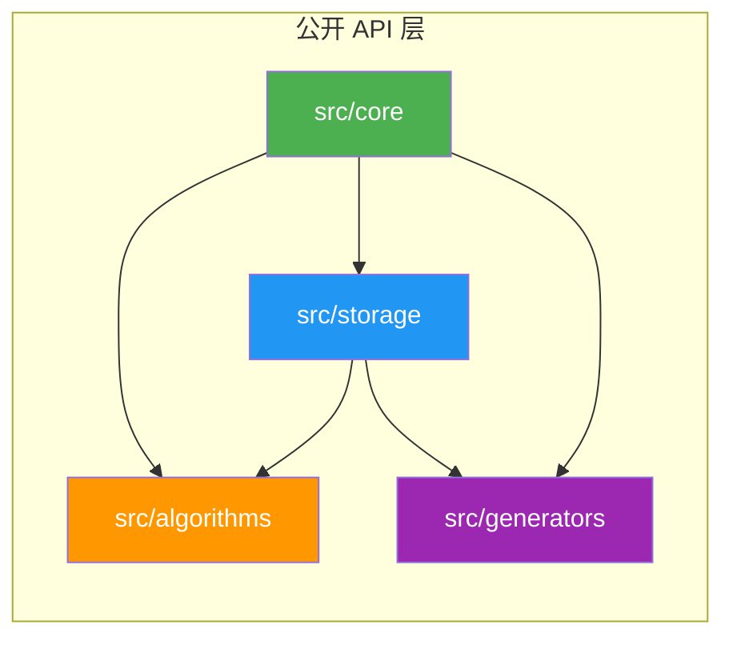

# mbtgraph 系统架构设计 (SAD)

> **版本**: v0.2.0 | **状态**: 草稿 | **日期**: 2026-05-08

---

## 1. 架构概述

### 1.1 设计目标

- **纯库设计**: 可被其他 MoonBit 项目依赖，无应用层
- **Trait 驱动**: 通过 Trait 定义抽象接口，支持多种图实现
- **泛型安全**: 利用 MoonBit 泛型系统保证编译期类型检查
- **模块解耦**: 清晰的包边界，按功能域划分，最小化依赖
- **SOLID 原则**: 遵循单一职责、开放封闭、里氏替换、接口隔离、依赖倒置

### 1.2 架构原则

| 原则 | 说明 |
|------|------|
| **单一职责** | 每个包/模块只负责一个功能域 |
| **依赖倒置** | 高层模块依赖抽象（Trait），不依赖具体实现 |
| **接口隔离** | 提供最小接口，消费者按需组合 |
| **开闭原则** | 对扩展开放（通过 Trait 实现新图类型），对修改关闭 |
| **里氏替换** | 只读存储不实现可写 trait，避免违反 LSP |

### 1.3 架构参考来源

| 参考库 | 借鉴要点 |
|--------|----------|
| **NetworkX** | 模块化组织、全面的算法分类体系 |
| **petgraph (Rust)** | 多图类型、visit trait 层次、Index-based 节点标识 |
| **JGraphT (Java)** | 接口驱动架构、类型安全的 API 设计 |
| **LEMON (C++)** | 高性能流算法实现策略 |
| **gonum/graph (Go)** | 网络分析工具集的组织方式 |

---

## 2. 系统上下文与模块架构

### 2.1 模块依赖关系



### 2.2 目录结构（扁平化设计）

**设计原则**: 初期采用扁平结构,当单文件超过 400 行或子包内文件超过 3 个时再拆分。

```
src/
├── core/                          # 核心抽象层
│   ├── moon.pkg
│   ├── types.mbt                  # NodeId, Node, Edge
│   ├── error.mbt                  # GraphError
│   ├── traits.mbt                 # 所有 trait 定义
│   └── core_wbtest.mbt            # 白盒测试
│
├── storage/                       # 存储实现层 (单包平铺)
│   ├── moon.pkg
│   ├── adjacency_list.mbt         # AdjacencyListGraph
│   ├── adjacency_matrix.mbt       # AdjacencyMatrixGraph
│   ├── csr.mbt                    # CSRGraph + CSRBuilder
│   ├── edge_list.mbt              # EdgeListGraph
│   ├── converter.mbt              # 格式转换器
│   ├── mod.mbt                    # 统一导出
│   └── storage_wbtest.mbt         # 存储层集成测试
│
├── algorithms/                    # 算法层
│   ├── moon.pkg
│   ├── traversal.mbt              # BFS/DFS
│   ├── shortest_path.mbt          # Dijkstra/Bellman-Ford (延后)
│   ├── mst.mbt                    # Kruskal/Prim (延后)
│   ├── connectivity.mbt           # 连通分量
│   ├── topology.mbt               # 拓扑排序 (延后)
│   ├── mod.mbt
│   └── algo_test.mbt              # 黑盒测试
│
├── generators/                    # 图生成器
│   ├── moon.pkg
│   ├── classic.mbt                # 完全图、环、路径等
│   ├── random.mbt                 # 随机图
│   ├── mod.mbt
│   └── gen_test.mbt
│
└── lib.mbt                        # 库入口（统一导出）
```

### 2.3 模块职责矩阵

| 模块 | 职责 | 对外暴露 | 内部依赖 |
|------|------|----------|----------|
| `core` | 图数据结构与抽象 | ✅ 所有 Trait 和基础类型 | - |
| `storage` | 多种存储实现 | ✅ 所有图类型实现 | core |
| `algorithms` | 经典图论算法 | ✅ 各算法函数 | core, storage |
| `generators` | 图生成器 | ✅ 经典图/随机图生成器 | core, storage |

**关键简化**: storage 层从 5 个子包合并为 1 个包，所有存储实现在同一命名空间下，无需子包间依赖。

### 2.4 包依赖配置

**src/core/moon.pkg**
```
options(
  "is-main": false,
)
```

**src/storage/moon.pkg**
```
options(
  "is-main": false,
)
import "mbtgraph/src/core"
```

**src/algorithms/moon.pkg**
```
options(
  "is-main": false,
)
import "mbtgraph/src/core"
```

**src/generators/moon.pkg**
```
options(
  "is-main": false,
)
import "mbtgraph/src/core"
import "mbtgraph/src/storage"
```

---

## 3. 核心设计

### 3.1 Trait 层次架构

#### 3.1.1 设计原则

不同存储结构的核心矛盾：

| 矛盾点 | 说明 |
|--------|------|
| 动态 vs 只读 | CSR 构建后不可修改，邻接表完全动态 |
| 入边查询 | 邻接表需反向索引，CSR 需 CSC 辅助 |
| 随机访问 | 邻接矩阵 O(1)，邻接表 O(deg) |
| 批量处理 | CSR 极佳，邻接表不适用 |

因此不能设计一个"大一统"的 trait，必须**分层隔离**。

#### 3.1.2 Trait 层次图

```
┌─────────────────────────────────────────────────────────┐
│                    Trait 继承层次                        │
├─────────────────────────────────────────────────────────┤
│                                                         │
│  ┌─────────────────────────────────────────────────┐   │
│  │         GraphReadable                            │   │
│  │         (基础只读接口 — 所有存储都实现)           │   │
│  │                                                  │   │
│  │  · node_count / edge_count                       │   │
│  │  · contains_node / contains_edge                 │   │
│  │  · get_node / get_edge                           │   │
│  │  · neighbors / degree                            │   │
│  └─────────────────────────────────────────────────┘   │
│            ▲                    ▲                       │
│            │                    │                       │
│     ┌──────┴──────┐      ┌─────┴──────┐                │
│     ▼             ▼      ▼            ▼                │
│  ┌──────────────────┐ ┌──────────────────┐            │
│  │ GraphWritable    │ │ GraphDirected    │            │
│  │ (可写 — 动态存储) │ │ (有向 — 入边查询) │            │
│  │                  │ │                  │            │
│  │ · add_node       │ │ · in_neighbors   │            │
│  │ · remove_node    │ │ · in_degree      │            │
│  │ · add_edge       │ │ · out_neighbors  │            │
│  │ · remove_edge    │ │ · out_degree     │            │
│  │ · clear          │ │ · predecessors   │            │
│  └──────────────────┘ └──────────────────┘            │
│            ▲                    ▲                       │
│            └────────┬───────────┘                       │
│                     ▼                                   │
│  ┌─────────────────────────────────────────────────┐   │
│  │         GraphFull                                │   │
│  │         = GraphWritable + GraphDirected          │   │
│  │         (完整图 — 便捷别名)                       │   │
│  └─────────────────────────────────────────────────┘   │
│                                                         │
│  特殊能力 trait (正交扩展):                               │
│  ┌──────────────────┐ ┌──────────────────┐            │
│  │ GraphBatchReadable│ │ GraphEdgeIterable│            │
│  │ (CSR 批量优化)    │ │ (边遍历优化)      │            │
│  └──────────────────┘ └──────────────────┘            │
│                                                         │
└─────────────────────────────────────────────────────────┘
```

#### 3.1.3 详细 Trait 定义

**Layer 1: GraphReadable — 基础只读接口**

```moonbit
/// 图只读接口
/// 所有存储实现的最低要求，符合接口隔离原则 (ISP)
/// 只包含所有实现都能提供的方法
pub trait GraphReadable {
  /// 节点数量
  node_count(Self) -> Int

  /// 边数量
  edge_count(Self) -> Int

  /// 检查节点是否存在
  contains_node(Self, NodeId) -> Bool

  /// 检查边是否存在
  contains_edge(Self, NodeId, NodeId) -> Bool

  /// 获取节点数据
  get_node(Self, NodeId) -> Double?

  /// 获取边数据
  get_edge(Self, NodeId, NodeId) -> Double?

  /// 获取邻居节点（出边目标）
  neighbors(Self, NodeId) -> Iter[NodeId]

  /// 节点度（无向图）或出度（有向图）
  degree(Self, NodeId) -> Int

  /// 是否为有向图
  is_directed(Self) -> Bool

  /// 是否为空图
  is_empty(Self) -> Bool

  /// 迭代所有节点 ID
  node_ids(Self) -> Iter[NodeId]

  /// 迭代所有边 (from, to, weight)
  edges(Self) -> Iter[(NodeId, NodeId, Double)]
}
```

**设计决策**:

- `neighbors` 返回 `Iter[NodeId]` 而非 `Array[NodeId]`，零分配、惰性求值
- 提供 `node_ids` 和 `edges` 迭代器，方便算法遍历
- `is_directed` 用于算法判断图类型
- MVP 阶段节点/边数据固定为 `Double`，后续可泛型化

**Layer 2A: GraphWritable — 可写接口**

```moonbit
/// 图可写接口
/// 仅适用于支持动态修改的存储（邻接表、邻接矩阵、混合图）
/// CSR 等只读存储不实现此 trait，符合里氏替换原则 (LSP)
pub trait GraphWritable: GraphReadable {
  /// 添加节点，返回其 ID
  add_node(Self, Double) -> NodeId

  /// 删除节点及其关联的所有边
  remove_node(Self, NodeId) -> Bool

  /// 添加边
  add_edge(Self, NodeId, NodeId, Double) -> Result[Unit, GraphError]

  /// 删除边
  remove_edge(Self, NodeId, NodeId) -> Bool

  /// 清空图
  clear(Self) -> Unit
}
```

**设计决策**:

- `add_node` 返回 `NodeId`，调用者可保存引用
- `add_edge` 返回 `Result`，可处理节点不存在等错误
- CSR 不实现此 trait，避免抛出 `NotImplementedError`

**Layer 2B: GraphDirected — 有向图扩展**

```moonbit
/// 有向图扩展接口
/// 提供入边查询能力，邻接表需维护反向索引
pub trait GraphDirected: GraphReadable {
  /// 获取前驱节点（入边源）
  in_neighbors(Self, NodeId) -> Iter[NodeId]

  /// 获取后继节点（出边目标）
  out_neighbors(Self, NodeId) -> Iter[NodeId]

  /// 入度
  in_degree(Self, NodeId) -> Int

  /// 出度
  out_degree(Self, NodeId) -> Int

  /// 前驱边 (源节点, 边数据)
  predecessors(Self, NodeId) -> Iter[(NodeId, Double)]

  /// 后继边 (目标节点, 边数据)
  successors(Self, NodeId) -> Iter[(NodeId, Double)]
}
```

**Layer 3: GraphFull — 完整图别名**

```moonbit
/// 完整图接口别名
/// 组合可写 + 有向图能力，适用于邻接表等通用实现
pub trait GraphFull: GraphWritable + GraphDirected {
  // 无需额外方法，仅作类型约束的便捷别名
}
```

#### 3.1.4 各存储实现的 Trait 实现矩阵

| 存储类型 | 实现的 Traits |
|----------|--------------|
| **AdjacencyList** (邻接表) | GraphFull + GraphEdgeIterable |
| **AdjacencyMatrix** (邻接矩阵) | GraphFull |
| **CSR** (压缩稀疏行) | GraphReadable + GraphBatchReadable + GraphDirected (需同时建 CSC) |
| **EdgeList** (边集数组) | GraphReadable + GraphEdgeIterable + GraphWritable |
| **Hybrid** (混合图) | GraphFull |

#### 3.1.5 SOLID 原则合规性分析

| 原则 | 应用方式 | 具体体现 |
|------|----------|----------|
| **S**RP 单一职责 | 每个 trait 只负责一类操作 | `GraphReadable` 只管读取，不管写入 |
| **O**CP 开放封闭 | 新增存储只需实现现有 trait | CSR 实现 `GraphReadable` + `GraphBatchReadable` |
| **L**SP 里氏替换 | 只读存储不实现可写 trait | CSR 不实现 `GraphWritable`，避免运行时错误 |
| **I**SP 接口隔离 | 拆分小接口而非大杂烩 | 分离 `GraphDirected`（入边查询） |
| **D**IP 依赖倒置 | 算法依赖 trait 而非具体类型 | `bfs[G: GraphReadable](g: G)` 而非 `bfs(AdjacencyListGraph)` |

### 3.2 核心数据结构

#### 3.2.1 NodeId — 节点标识符

```moonbit
/// 节点唯一标识符（整数索引）
pub struct NodeId(Int) derive(Debug, Eq)

/// NodeId Show 实现
impl Show for NodeId with to_string(self : NodeId) -> String {
  self.0.to_string()
}
```

**ID 管理策略**:

- 默认自增：0, 1, 2, ...
- 可选回收：维护 `freed_ids: Array[NodeId]` 池
- 初期不实现回收（简化逻辑）
- 后期添加 `compact` 方法重建 ID 映射

#### 3.2.2 Node — 节点

```moonbit
/// 带数据的节点
pub(all) struct Node {
  id : NodeId
  data : Double
} derive(Debug)

/// Node Show 实现
pub impl Show for Node with to_string(self : Node) -> String {
  "Node { id: \{self.id}, data: \{self.data} }"
}
```

**设计说明**:

- 使用 `pub(all)` 可见性，允许模块内其他包构造节点
- MVP 阶段数据固定为 `Double`，后续可泛型化为 `Node[T]`
- Show 实现标记为 `pub`，确保跨包可用

#### 3.2.3 Edge — 边

```moonbit
/// 带数据的边
pub(all) struct Edge {
  from : NodeId
  to : NodeId
  data : Double
} derive(Debug)

/// Edge Show 实现
pub impl Show for Edge with to_string(self : Edge) -> String {
  "Edge { from: \{self.from}, to: \{self.to}, data: \{self.data} }"
}
```

**设计说明**:

- 使用 `pub(all)` 可见性，允许模块内其他包构造边
- MVP 阶段数据固定为 `Double`，后续可泛型化为 `Edge[T]`

#### 3.2.4 GraphError — 错误类型

```moonbit
/// 图操作错误类型
pub enum GraphError {
  NodeNotFound(NodeId)
  EdgeAlreadyExists(NodeId, NodeId)
  InvalidNodeId
} derive(Debug, Eq)

/// GraphError Show 实现
pub impl Show for GraphError with to_string(self : GraphError) -> String {
    match self {
      NodeNotFound(id) => "NodeNotFound(\{id})"
      EdgeAlreadyExists(from, to) => "EdgeAlreadyExists(\{from}, \{to})"
      InvalidNodeId => "InvalidNodeId"
    }
}
```

---

## 4. 存储实现设计

### 4.1 存储方式选型

基于 [graph_storage_survey.md](file:///e:/Workplace/APP/MoonBit/mbtgraph/docs/design/graph_storage_survey.md) 调研分析，采用以下策略：

| 场景 | 实现方案 | Trait 实现 |
|------|----------|-----------|
| **默认实现** | 邻接表 (`AdjacencyListGraph`) | GraphFull |
| **稠密图优化** | 邻接矩阵 (`AdjacencyMatrixGraph`) | GraphFull |
| **大规模只读** | CSR 格式 (`CSRGraph`) | GraphReadable + GraphBatchReadable |
| **边排序场景** | 边集数组 (`EdgeListGraph`) | GraphReadable + GraphEdgeIterable |

### 4.2 邻接表 (AdjacencyListGraph)

**数据结构**:

```moonbit
pub struct AdjacencyListGraph {
  mut next_id: Int
  nodes: Array[Node]
  // adj[i] = [(target_id, edge_data), ...]
  adj: Array[Array[(NodeId, Double)]]
  // 反向邻接（有向图入边查询）
  mut directed: Bool
  rev_adj: Array[Array[(NodeId, Double)]]
}
```

**配套方法**:

```moonbit
impl AdjacencyListGraph {
  /// 创建新图
  pub fn new(directed: Bool) -> AdjacencyListGraph

  /// 批量添加节点
  pub fn add_nodes(self, Array[Double]) -> Array[NodeId]

  /// 查找匹配的节点
  pub fn find_nodes(self, (Double) -> Bool) -> Array[NodeId]

  /// 提取子图
  pub fn subgraph(self, Array[NodeId]) -> AdjacencyListGraph

  /// 图的密度
  pub fn density(self) -> Double
}
```

**实现策略**:

- `adj` 存储出边，`rev_adj` 存储入边
- 无向图：添加边时同时更新 `adj` 和 `rev_adj`
- 删除节点时压缩数组（可选：或标记删除+ID 回收）

### 4.3 邻接矩阵 (AdjacencyMatrixGraph)

**数据结构**:

```moonbit
pub struct AdjacencyMatrixGraph {
  mut size: Int
  capacity: Int
  nodes: Array[Option[Node]]
  matrix: Array[Array[Option[Double]]]
  directed: Bool
}
```

**配套方法**:

```moonbit
impl AdjacencyMatrixGraph {
  pub fn new(capacity: Int, directed: Bool) -> AdjacencyMatrixGraph

  /// 扩容
  fn resize(self, Int) -> Unit
}
```

**实现策略**:

- 预分配 `capacity × capacity` 矩阵
- `resize` 时重新分配（成本高，仅在必要时调用）
- 适合 V < 1000 的稠密图

### 4.4 CSR 格式 (CSRGraph)

**数据结构**:

```moonbit
pub struct CSRGraph {
  nodes: Array[Node]
  row_ptr: Array[Int]
  col_idx: Array[NodeId]
  values: Array[Double]
  directed: Bool
}
```

**构建器模式**:

```moonbit
pub struct CSRBuilder {
  mut nodes: Array[Node]
  mut edges: Array[(NodeId, NodeId, Double)]
}

impl CSRBuilder {
  pub fn new() -> CSRBuilder
  pub fn add_node(self, NodeId, Double) -> Unit
  pub fn add_edge(self, NodeId, NodeId, Double) -> Unit
  pub fn build(self) -> CSRGraph
}
```

**实现策略**:

- 只读格式，通过 CSRBuilder 构建
- 构建时排序边，计算 row_ptr
- 可选同时构建 CSC 用于入边查询

### 4.5 边集数组 (EdgeListGraph)

**数据结构**:

```moonbit
pub struct EdgeListGraph {
  mut next_id: Int
  nodes: Array[Node]
  edges: Array[Edge]
}
```

**实现策略**:

- 最简单的存储方式
- 主要用于 Kruskal 等需要边排序的场景
- 查询效率低，但实现简单

### 4.6 格式转换器 (GraphConverter)

```moonbit
pub struct GraphConverter

impl GraphConverter {
  /// 任意可迭代图 -> 邻接表
  pub fn to_adjacency_list(
    GraphReadable,
    Bool
  ) -> AdjacencyListGraph

  /// 任意可迭代图 -> CSR
  pub fn to_csr(
    GraphReadable
  ) -> CSRGraph

  /// 任意可迭代图 -> 邻接矩阵
  pub fn to_adjacency_matrix(
    GraphReadable,
    Int
  ) -> AdjacencyMatrixGraph

  /// 边集 -> 任意格式
  pub fn from_edges(
    Array[Node],
    Array[(NodeId, NodeId, Double)],
    Bool
  ) -> AdjacencyListGraph
}
```

---

## 5. 算法模块设计

### 5.1 算法签名模式

所有算法依赖 `GraphReadable` 或特定 trait，而非具体存储类型：

```moonbit
/// BFS — 只需要 GraphReadable
pub fn bfs[G: GraphReadable](
  graph: G,
  start: NodeId
) -> Iter[NodeId]

/// Dijkstra — 需要 GraphReadable，边数据需为数值类型
pub fn dijkstra[G: GraphReadable](
  graph: G,
  start: NodeId
) -> Map[NodeId, Double]

/// Kruskal — 需要边排序能力
pub fn kruskal[G: GraphReadable + GraphEdgeIterable](
  graph: G
) -> Array[(NodeId, NodeId, Double)]
```

### 5.2 算法分类

| 算法类别 | 文件 | 所需 Trait | 复杂度 |
|----------|------|-----------|--------|
| BFS/DFS | traversal.mbt | GraphReadable | O(V+E) |
| Dijkstra | shortest_path.mbt | GraphReadable | O((V+E)log V) |
| Bellman-Ford | shortest_path.mbt | GraphReadable + GraphEdgeIterable | O(VE) |
| Kruskal | mst.mbt | GraphReadable + GraphEdgeIterable | O(E log E) |
| Prim | mst.mbt | GraphReadable | O((V+E)log V) |
| 连通分量 | connectivity.mbt | GraphReadable | O(V+E) |
| 拓扑排序 | topology.mbt | GraphDirected | O(V+E) |

### 5.3 算法返回类型设计

| 算法 | 返回类型 | 理由 |
|------|---------|------|
| BFS/DFS | `Iter[NodeId]` | 惰性求值，避免全量分配 |
| Dijkstra | `Map[NodeId, Double]` | 需要随机访问距离 |
| Kruskal/Prim | `Array[(NodeId, NodeId, Double)]` | 返回边集，需多次遍历 |
| 连通分量 | `Array[Array[NodeId]]` | 分量集合 |
| 拓扑排序 | `Result[Array[NodeId], GraphError]` | 可能有环 |

---

## 6. 使用示例

### 6.1 基础使用

```moonbit
use mbtgraph::{AdjacencyListGraph, GraphWritable, GraphDirected}

fn main {
  // 创建有向图
  let graph = AdjacencyListGraph::new(true)

  // 添加节点
  let a = GraphWritable::add_node(graph, 1.0)
  let b = GraphWritable::add_node(graph, 2.0)
  let c = GraphWritable::add_node(graph, 3.0)

  // 添加边
  GraphWritable::add_edge(graph, a, b, 1.0)
  GraphWritable::add_edge(graph, b, c, 2.0)

  // 查询
  println(GraphReadable::node_count(graph))  // 3
  println(GraphReadable::contains_edge(graph, a, b))  // true
}
```

### 6.2 算法使用

```moonbit
use mbtgraph::{AdjacencyListGraph, GraphWritable, bfs, dijkstra}

fn main {
  let graph = AdjacencyListGraph::new(true)
  let s = GraphWritable::add_node(graph, 1.0)
  let t = GraphWritable::add_node(graph, 2.0)

  // BFS 遍历
  for node_id in bfs(graph, s) {
    println(GraphReadable::get_node(graph, node_id))
  }

  // Dijkstra 最短路径
  let distances = dijkstra(graph, s)
}
```

### 6.3 存储转换

```moonbit
use mbtgraph::{AdjacencyListGraph, GraphWritable, GraphConverter, CSRGraph}

fn main {
  // 动态构建
  let list_graph = AdjacencyListGraph::new(true)
  // ... 添加节点和边 ...

  // 转换为 CSR 用于高性能只读查询
  let csr_graph = GraphConverter::to_csr(list_graph)

  // CSR 仍然实现 GraphReadable，算法无需修改
  for node_id in bfs(csr_graph, start) {
    // ...
  }
}
```

---

## 7. 错误处理

### 7.1 错误类型

见 [3.2.4 GraphError](#324-grapherror--错误类型)

### 7.2 错误处理策略

| 场景 | 处理方式 | 返回值类型 |
|------|----------|-----------|
| 节点/边不存在 | 返回错误 | `Result[T, GraphError]` |
| 参数无效 | 返回错误 | `Result[T, GraphError]` |
| 算法不收敛 | 返回部分结果 | `Result { value, converged: false }` |
| 可选值缺失 | 返回 None | `Option[T]` |

---

## 8. 关键设计决策

### 决策 1: Trait 继承语法

**MoonBit 支持**: `pub trait B: A` 语法已确认可用（参考官方文档 "Extending traits"）。

**方案**: 使用 trait 继承

```moonbit
pub trait GraphWritable: GraphReadable { ... }
```

### 决策 2: neighbors 返回类型

| 方案 | 优点 | 缺点 |
|------|------|------|
| `Iter[NodeId]` | 零分配、惰性求值、大图友好 | 只能遍历一次 |
| `Array[NodeId]` | 可多次遍历、支持索引 | 额外内存分配 |

**决定**: 默认返回 `Iter[NodeId]`，在存储实现上提供辅助方法 `collect_neighbors(self, NodeId) -> Array[NodeId]`。

### 决策 3: 有向图/无向图处理

**方案**: 通过 `directed: Bool` 标志控制，统一 trait。

- 有向图：`adj` 存出边，`rev_adj` 存入边
- 无向图：添加边时同时更新两个方向

### 决策 4: NodeId 管理

**方案**: 自增 ID + 可选回收池

```moonbit
pub struct AdjacencyListGraph {
  mut next_id: Int
  freed_ids: Array[NodeId]  // 可选：删除节点后 ID 回收
  // ...
}
```

**初期**: 不实现回收（简化逻辑）
**后期**: 添加 `compact` 方法重建 ID 映射

### 决策 5: 算法参数类型

**方案**: 算法使用 trait 约束，而非具体类型。

```moonbit
// 推荐：依赖 trait
pub fn bfs[G: GraphReadable](graph: G, start: NodeId) -> ...

// 不推荐：依赖具体类型
pub fn bfs(graph: AdjacencyListGraph, start: NodeId) -> ...
```

通过 `inline` 关键字可优化虚调用开销。

### 决策 6: 数据类型策略

**MVP 阶段**: 节点/边数据固定为 `Double`

```moonbit
pub struct Node {
  id : NodeId
  data : Double
} derive(Debug)
```

**后续泛型化**: 支持任意类型

```moonbit
pub struct Node[T] {
  id : NodeId
  data : T
} derive(Debug)
```

---

## 9. 实现路线图

### 阶段 1: 核心基础 (P0)

| 任务 | 文件 | 说明 |
|------|------|------|
| 定义 NodeId, Node, Edge | types.mbt | 从现有 graph.mbt 重构 |
| 定义 GraphError | error.mbt | 错误类型 |
| 定义 4 个基础 trait | traits.mbt | GraphReadable/Writable/Directed/Full |

### 阶段 2: 邻接表实现 (P1)

| 任务 | 文件 | 说明 |
|------|------|------|
| 邻接表结构定义 | storage/adjacency_list.mbt | AdjacencyListGraph |
| 实现 GraphWritable | storage/adjacency_list.mbt | 增删节点/边 |
| 实现 GraphDirected | storage/adjacency_list.mbt | 入边/出边查询 |
| 单元测试 | storage/storage_wbtest.mbt | 覆盖核心功能 |

### 阶段 3: 基础算法 (P2)

| 任务 | 文件 | 说明 |
|------|------|------|
| BFS/DFS | algorithms/traversal.mbt | 验证 trait 设计 |
| 连通分量 | algorithms/connectivity.mbt | 并查集或 DFS |
| 算法测试 | algorithms/algo_test.mbt | 使用生成器建图测试 |

### 阶段 4: CSR 实现 (P3)

| 任务 | 文件 | 说明 |
|------|------|------|
| CSR 结构 | storage/csr.mbt | CSRGraph |
| CSRBuilder | storage/csr.mbt | 构建器模式 (同一文件) |
| 实现 GraphReadable | storage/csr.mbt | 只读接口 |
| 实现 GraphBatchReadable | storage/csr.mbt | 批量优化 |
| 转换器 | storage/converter.mbt | to_csr / from_edges |

### 阶段 5: 扩展 (P4+)

| 任务 | 说明 |
|------|------|
| 邻接矩阵 | storage/adjacency_matrix.mbt 预分配矩阵，适合小稠密图 |
| 边集数组 | storage/edge_list.mbt 边排序优化 |
| 最短路径 | algorithms/shortest_path.mbt Dijkstra, Bellman-Ford |
| 最小生成树 | algorithms/mst.mbt Kruskal, Prim |
| 拓扑排序 | algorithms/topology.mbt 基于 GraphDirected |
| 图生成器 | generators/ 经典图 + 随机图 |

---

## 10. 测试策略

### 10.1 测试层次

| 层级 | 测试类型 | 文件模式 | 示例 |
|------|---------|---------|------|
| 单元测试 | 白盒测试 | `*_wbtest.mbt` | 单个存储实现的方法测试 |
| 集成测试 | 黑盒测试 | `*_test.mbt` | 算法在不同存储上运行 |
| 属性测试 | 生成器 + 断言 | `*_wbtest.mbt` | 图生成器 + 算法验证 |

### 10.2 关键测试场景

```moonbit
/// 所有 GraphWritable 实现的通用测试
test "add_node returns sequential ids" {
  let g = AdjacencyListGraph::new(true)
  let id1 = GraphWritable::add_node(g, 1.0)
  let id2 = GraphWritable::add_node(g, 2.0)
  assert_eq(id1, NodeId(0))
  assert_eq(id2, NodeId(1))
}

/// BFS 在不同存储上的一致性
test "bfs produces same result on list and csr" {
  let list = build_test_graph_list()
  let csr = GraphConverter::to_csr(list)
  assert_eq(collect(bfs(list, start)), collect(bfs(csr, start)))
}
```

### 10.3 测试方法

- **正确性断言**: `assert_eq(result, expected)` 用于确定结果
- **属性检验**: PageRank scores 之和 ≈ 1.0; MST 必须连接所有节点
- **性能回归**: 10K 节点 Dijkstra < 100ms (native 目标)
- **快照测试**: 复杂输出用 snapshot 记录当前行为

---

## 11. 版本规划

| 版本 | 重点 | 里程碑 |
|------|------|--------|
| **v0.1.0** | 核心基础 | 图结构 + Trait 定义 + 邻接表实现 |
| **v0.2.0** | 算法完善 | BFS/DFS + Dijkstra + 连通分量 + CSR |
| **v0.3.0** | 高级算法 | 最短路径 + MST + 拓扑排序 + 图生成器 |
| **v0.4.0** | 生态完善 | 邻接矩阵 + 边集数组 + 文档 + 发布 mooncakes |
| **v1.0.0** | 生产就绪 | API 稳定 + 全覆盖测试 + 性能达标 |

---

## 12. 与现有代码的迁移策略

### 12.1 当前状态

现有 `src/core/` 目录包含：

- `types.mbt`: `NodeId`, `Node`, `Edge` 定义（MVP 使用 `Double`）
- `traits.mbt`: 分层 trait 定义（已实现）
- `error.mbt`: `GraphError` 枚举

### 12.2 迁移步骤

```
graph.mbt (现有)
    │
    ▼
┌──────────────────────────────────┐
│ 1. 拆分文件                       │
│    - types.mbt   → NodeId, Node, Edge
│    - error.mbt   → GraphError
│    - traits.mbt  → 分层 trait      │
├──────────────────────────────────┤
│ 2. 数据类型                       │
│    MVP: Double 固定类型             │
│    后续: 泛型化 Node[T], Edge[T]   │
├──────────────────────────────────┤
│ 3. 迁移 AdjGraph                  │
│    → storage/adjacency_list.mbt   │
│    → 实现 GraphWritable + Directed│
├──────────────────────────────────┤
│ 4. 保留兼容性                     │
│    类型别名: Graph = AdjacencyListGraph│
└──────────────────────────────────┘
```

### 12.3 向后兼容

```moonbit
/// 向后兼容别名
pub type Graph = AdjacencyListGraph
```

---

## 附录

### 附录 A: 参考文档

- [软件需求规格](docs/requirements/srs.md)
- [图存储调研分析](docs/design/graph_storage_survey.md)
- [图 Trait 与模块架构](docs/design/graph_trait_and_module_architecture.md)

### 附录 B: 版本历史

| 版本 | 日期 | 变更说明 |
|------|------|----------|
| v0.1.0 | 2026-05-02 | 初始版本，定义核心架构和算法设计 |
| v0.2.0 | 2026-05-08 | 重构架构：Trait 分层、存储多实现、模块扁平化 |

---

**文档状态**: 草稿 ⏳  
**待办事项**: 
- [ ] 补充 Phase 3 高级算法架构设计
- [ ] 补充 I/O 模块详细设计
- [ ] 添加更多 Mermaid 流程图

---

**参考资料**:
- NetworkX documentation: https://networkx.org/documentation/
- petgraph: https://petgraph.github.io/petgraph/
- GraphBLAS: https://graphblas.org/
- MoonBit Trait 文档: https://docs.moonbitlang.com/en/stable/language/methods.html
