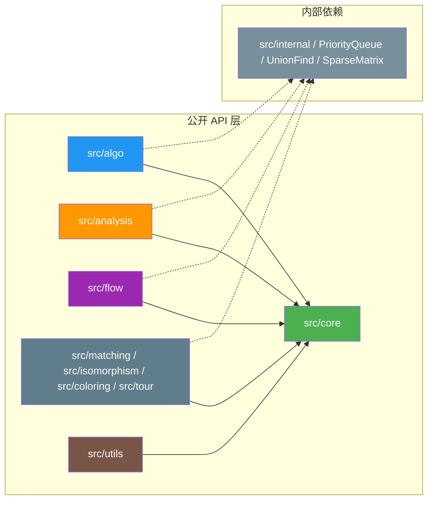

# mbtgraph 系统架构设计 (SAD)

> **版本**: v0.1.0 | **状态**: 草稿 | **日期**: 2026-05-02

---

## 1. 架构概述

### 1.1 设计目标

- **纯库设计**: 可被其他 MoonBit 项目依赖，无应用层
- **Trait 驱动**: 通过 Trait 定义抽象接口，支持多种图实现
- **泛型安全**: 利用 MoonBit 泛型系统保证编译期类型检查
- **模块解耦**: 清晰的包边界，按功能域划分，最小化依赖

### 1.2 架构原则

| 原则 | 说明 |
|------|------|
| **单一职责** | 每个包/模块只负责一个功能域 |
| **依赖倒置** | 高层模块依赖抽象（Trait），不依赖具体实现 |
| **接口隔离** | 提供最小接口，消费者按需组合 |
| **开闭原则** | 对扩展开放（通过 Trait 实现新图类型），对修改关闭 |

---

## 2. 系统上下文

### 2.1 系统边界

```
┌─────────────────────────────────────────────────┐
│                 消费者项目                        │
│                                                   │
│  ┌──────────────────────────────────────────┐    │
│  │  业务代码                                 │    │
│  │  use morning-start/mbtgraph/...          │    │
│  └──────────────────┬───────────────────────┘    │
└─────────────────────┼───────────────────────────┘
                      │ depends on
┌─────────────────────▼───────────────────────────┐
│                mbtgraph 库                       │
│                                                   │
│  ┌────────────┐  ┌─────────┐  ┌──────────────┐  │
│  │ core/      │  │ algo/   │  │ analysis/    │  │
│  │ 核心抽象    │  │ 经典算法 │  │ 网络分析      │  │
│  └────────────┘  └─────────┘  └──────────────┘  │
│  ┌────────────┐  ┌─────────┐  ┌──────────────┐  │
│  │ flow/      │  │ utils/  │  │ internal/    │  │
│  │ 流网络      │  │ 工具集   │  │ 内部设施      │  │
│  └────────────┘  └─────────┘  └──────────────┘  │
└─────────────────────────────────────────────────┘
```

### 1.3 架构参考来源

| 参考库 | 借鉴要点 |
|--------|----------|
| **NetworkX** | 模块化组织、全面的算法分类体系 |
| **petgraph (Rust)** | 多图类型、Index-based 节点标识 |
| **JGraphT (Java)** | 接口驱动架构、类型安全的 API 设计 |
| **LEMON (C++)** | 高性能流算法实现策略 |
| **gonum/graph (Go)** | 网络分析工具集的组织方式 |

---

## 3. 模块架构

### 3.1 模块依赖关系



### 3.2 模块职责矩阵

| 模块 | 职责 | 对外暴露 | 内部依赖 |
|------|------|----------|----------|
| `core` | 图数据结构与抽象 | ✅ 所有 Trait 和实现 | - |
| `algo` | 经典图论算法 | ✅ 各算法函数 | core, internal |
| `analysis` | 网络科学分析 | ✅ 各分析函数 | core, internal |
| `flow` | 流网络算法 | ✅ 各流算法函数 | core, internal |
| `utils` | 辅助工具 | ✅ I/O、生成器、布局 | core |
| `internal` | 内部基础设施 | ❌ 不对外暴露 | - |

---

## 4. 核心设计

### 4.1 类型系统

#### 4.1.1 基础类型

```
基础标识符类型:
┌─────────────────────────────────────────────────┐
│  NodeId = Int64                                │  ← 节点唯一标识 (支持 >2^32 节点)
│  EdgeId = Int64                                │  ← 边唯一标识
│                                                 │
│  struct EdgeKey {                               │  ← 无向边去重键
│    from: NodeId                                 │
│    to: NodeId                                   │
│  }                                              │
└─────────────────────────────────────────────────┘
```

#### 4.1.2 核心 Trait 层次

```
                    ┌─────────────────┐
                    │     Graph       │  ← 最小接口: 查询操作
                    │  [N, E]          │
                    ├─────────────────┤
                    │ node_count()    │
                    │ edge_count()    │
                    │ contains_node() │
                    │ contains_edge() │
                    │ neighbors()     │
                    └────────┬────────┘
                             │
            ┌────────────────┼────────────────┐
            ▼                ▼                ▼
    ┌───────────────┐ ┌──────────────┐ ┌──────────────┐
    │ MutableGraph  │ │WeightedGraph │ │DirectedGraph │
    │ [N,E]:Graph   │ │ [N,E]:Graph  │ │ [N,E]:Graph  │
    ├───────────────┤ ├──────────────┤ ├──────────────┤
    │ add_node()    │ │ edge_weight()│ │ successors() │
    │ add_edge()    │ │ total_weight│ │ predecessors│
    │ remove_node() │ └──────┬───────┘ │ reverse()    │
    │ remove_edge() │        │         └──────┬───────┘
    │ set_weight()  │        ▼                │
    └───────────────┘ ┌──────────────┐        │
                      │UndirectedGraph│◄───────┘
                      │ [N,E]:Graph   │
                      ├──────────────┤
                      │ degree()      │
                      └──────────────┘
```

#### 4.1.3 数据结构选择指南

| 图特征 | 推荐实现 | 内部存储 | 适用规模 |
|--------|----------|----------|----------|
| 稀疏有向图 | `DirectedGraph` | 邻接表 + HashMap | V < 10M, E/V < 20 |
| 稠密有向图 | `DirectedDenseGraph` | 邻接矩阵 | V < 10K, E/V > 100 |
| 稀疏无向图 | `UndirectedGraph` | 邻接表 + HashSet | V < 10M |
| 只读静态图 | `StaticGraph` | CSR 格式 | V > 1M, 批量查询 |
| 多重图 | `MultiGraph` | 邻接表 + Vec | 允许平行边 |

### 4.2 算法设计

#### 4.2.1 BFS 广度优先搜索

**算法伪代码**:

```
算法: BREADTH_FIRST_SEARCH(G, source)
输入: 图 G, 起始节点 source
输出: BFSResult { discovered_order[], distance[], parent[] }

BEGIN
  初始化空队列 Q
  初始化 visited = ∅
  初始化 result.distance[source] = 0
  将 source 加入 Q
  标记 visited.add(source)

  WHILE Q 非空 DO
    u ← Q.pop_front()
    result.discovered_order.append(u)

    FOR EACH v ∈ G.neighbors(u) DO
      IF v ∉ visited THEN
        visited.add(v)
        result.parent[v] ← u
        result.distance[v] ← result.distance[u] + 1
        Q.push_back(v)
      END IF
    END FOR
  END WHILE

  RETURN result
END
```

**复杂度**: 时间 O(V+E), 空间 O(V)

#### 4.2.2 Dijkstra 最短路径

**算法伪代码**:

```
算法: DIJKSTRA(G, source, target?)
输入: 加权图 G (权重 ≥ 0), 源节点 source, 可选目标 target
输出: ShortestPathResult { distances[], predecessors[] } 或 Error

BEGIN
  FOR EACH node v ∈ G.nodes() DO
    dist[v] ← ∞
    prev[v] ← NIL
  END FOR
  dist[source] ← 0

  创建最小优先队列 PQ
  PQ.insert(source, 0)

  WHILE PQ 非空 DO
    (u, u_dist) ← PQ.extract_min()

    IF target ≠ NULL AND u == target THEN
      BREAK  // 提前终止
    END IF

    FOR EACH v ∈ G.successors(u) DO
      alt ← u_dist + G.weight(u, v)

      IF alt < dist[v] THEN
        dist[v] ← alt
        prev[v] ← u
        IF v ∈ PQ THEN
          PQ.decrease_key(v, alt)
        ELSE
          PQ.insert(v, alt)
        END IF
      END IF
    END FOR
  END WHILE

  RETURN { distances: dist, predecessors: prev }
END
```

**复杂度**: 时间 O((V+E) log V) 二叉堆, O(V²) 斐堆; 空间 O(V)

#### 4.2.3 Kosaraju 强连通分量 (SCC)

**算法伪代码**:

```
算法: KOSARAJU_SCC(G)
输入: 有向图 G
输出: SCCResult { components[], component_id[], count }

BEGIN
  // ========== Phase 1: 计算完成时间 ==========
  visited ← ∅
  finish_order ← []  // 空 list

  PROCEDURE DFS1(v)
    visited.add(v)
    FOR EACH u ∈ G.successors(v) DO
      IF u ∉ visited THEN
        DFS1(u)
      END IF
    END FOR
    finish_order.prepend(v)  // 记录完成时间 (前插)
  END PROCEDURE

  FOR EACH vertex v ∈ G.vertices() DO
    IF v ∉ visited THEN
      DFS1(v)
    END IF
  END FOR

  // ========== Phase 2: 在转置图上按逆序 DFS ==========
  GT ← G.transpose()  // 反转所有边方向
  visited.clear()
  components ← []
  component_id_map ← {}

  PROCEDURE DFS2(v, current_component)
    current_component.append(v)
    component_id_map[v] ← components.length - 1
    FOR EACH u ∈ GT.successors(v) DO  // 原 predecessors
      IF u ∉ visited THEN
        DFS2(u, current_component)
      END IF
    END FOR
  END PROCEDURE

  FOR EACH v ∈ finish_order (从后向前) DO
    IF v ∉ visited THEN
      new_component ← []
      DFS2(GT, v, new_component)
      components.append(new_component)
    END IF
  END FOR

  RETURN {
    components: components,
    component_id: component_id_map,
    count: components.length
  }
END
```

**复杂度**: 时间 O(V+E) 两遍 DFS; 空间 O(V)

#### 4.2.4 PageRank 迭代算法

**算法伪代码**:

```
算法: PAGERANK(G, damping=0.85, tolerance=1e-6, max_iter=100)
输入: 有向/无向图 G
输出: PageRankResult { scores[], iterations, converged }

BEGIN
  n ← G.node_count()
  PR[1..n] ← 1/n  // 初始均匀分布

  FOR iter = 1 TO max_iter DO
    max_diff ← 0
    new_PR[1..n] ← 0

    FOR i = 1 TO n DO
      rank_in_sum ← 0
      FOR EACH j ∈ G.predecessors(i) DO
        rank_in_sum += PR[j] / G.out_degree(j)
      END FOR
      new_PR[i] ← (1-damping)/n + damping × rank_in_sum

      diff ← |new_PR[i] - PR[i]|
      max_diff ← MAX(max_diff, diff)
    END FOR

    PR ← new_PR  // 更新

    IF max_diff < tolerance THEN
      RETURN { scores: PR, iterations: iter, converged: true }
    END IF
  END FOR

  RETURN { scores: PR, iterations: max_iter, converged: false }
END
```

**收敛性**: 保证收敛 (damping < 1 时); 实际 10-20 次迭代通常足够

---

## 5. 错误处理

### 5.1 错误类型定义

```
enum GraphError {
  NodeNotFound(NodeId)          // 节点不存在
  EdgeNotFound(EdgeId)          // 边不存在
  NegativeCycleDetected         // 检测到负权环
  DisconnectedGraph             // 图不连通
  InvalidParameter(String)      // 无效参数
  CycleDetectedInDAG            // DAG 中存在环
}
```

### 5.2 错误处理策略

| 场景 | 处理方式 | 返回值类型 |
|------|----------|-----------|
| 节点/边不存在 | 返回错误 | `Result[T, GraphError]` |
| 参数无效 | 返回错误 | `Result[T, GraphError]` |
| 算法不收敛 | 返回部分结果 | `Result { value, converged: false }` |
| 可选值缺失 | 返回 None | `Option[T]` |

---

## 6. 性能优化

### 6.1 数据结构选择矩阵

| 场景 | 推荐存储 | 查找复杂度 | 内存效率 |
|------|----------|-----------|----------|
| 一般稀疏图 | 邻接表 + HashSet | O(1) avg | ★★★★☆ |
| 稠密图 | 邻接矩阵 | O(1) | ★★☆☆☆ |
| 超大规模只读 | CSR (压缩稀疏行) | O(log deg) | ★★★★★ |
| 频繁动态修改 | 平衡树邻接表 | O(log d) | ★★★☆☆ |

### 6.2 关键优化技术

1. **预分配容量**: `Graph::with_capacity(nodes, edges)` 避免动态扩容
2. **缓存局部性**: 节点 ID 数组连续存储, 提高 cache 命中
3. **惰性计算**: PageRank/centrality 等仅在显式调用时计算
4. **SIMD 就绪**: 数值密集操作 (矩阵运算) 可利用向量指令

---

## 7. 测试架构

### 7.1 测试分层

```
test/
├── fixtures/              # 固定测试数据
│   ├── karate_club.dot   # 经典社交网络 (34节点, 78边)
│   ├── small_test.dot    # 手工构造的小图 (已知答案)
│   └── large_random.dot  # 大规模随机图 (性能基准)
│
├── *_test.mbt             # 各包单元测试 (moon test)
│   ├── core_test.mbt      # 图创建/修改/查询
│   ├── algo_test.mbt      # 各算法正确性
│   ├── analysis_test.mbt  # 中心性/社区检测验证
│   └── flow_test.mbt      # 流网络算法验证
│
└── integration_test.mbt    # 跨包集成场景
```

### 7.2 测试方法

- **正确性断言**: `assert_eq!(result, expected)` 用于确定结果
- **属性检验**: PageRank scores 之和 ≈ 1.0; MST 必须连接所有节点
- **性能回归**: 10K 节点 Dijkstra < 100ms (native 目标)
- **快照测试**: 复杂输出用 snapshot 记录当前行为

---

## 8. 版本规划

| 版本 | 重点 | 里程碑 |
|------|------|--------|
| **v0.1.0** | 核心基础 | 图结构 + BFS/DFS + Dijkstra + SCC |
| **v0.2.0** | 网络分析 | PageRank + Louvain/Leiden + MST + 图生成器 |
| **v0.3.0** | 高级算法 | MaxFlow + Matching + Isomorphism + Coloring + TSP |
| **v0.4.0** | 生态完善 | I/O + Layout + 文档 + 发布 mooncakes |
| **v1.0.0** | 生产就绪 | API 稳定 + 全覆盖测试 + 性能达标 |

---

## 9. 附录

### 9.1 参考文档

- [软件需求规格](docs/requirements/srs.md)
- [架构设计详细文档](docs/architecture/project_structure_design.md)
- [竞品调研报告](docs/reference/)

### 9.2 版本历史

| 版本 | 日期 | 变更说明 |
|------|------|----------|
| v0.1.0 | 2026-05-02 | 初始版本，定义核心架构和算法设计 |

---

**文档状态**: 草稿 ⏳  
**待办事项**: 
- [ ] 补充 Phase 3 高级算法架构设计
- [ ] 补充 I/O 模块详细设计
- [ ] 添加更多 Mermaid 流程图
