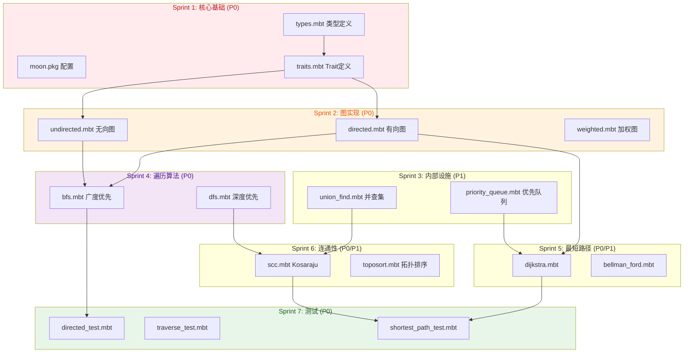

# mbtgraph 近期开发 TODO

> **版本**: v0.1.0 | **状态**: 活跃 | **日期**: 2026-05-02  
> **当前阶段**: Phase 1 - MVP 基础  
> **目标版本**: v0.1.0

---

## 📌 使用说明

- [ ] 待办
- [🔄] 进行中
- [✅] 已完成
- [📋] 待规划
- [⏸️] 暂缓

每个任务包含:
- **预估优先级**: P0 (紧急) / P1 (高) / P2 (中) / P3 (低)
- **预估工作量**: S (< 2h) / M (2-8h) / L (1-2天) / XL (> 2天)
- **验收标准**: 明确的完成条件

---

## 🏗️ Sprint 1: 核心基础设施 (当前)

**目标**: 建立项目骨架，实现核心类型和 Trait

### 1.1 项目配置

| 任务 | 优先级 | 工作量 | 状态 | 说明 |
|------|--------|--------|------|------|
| 创建 `moon.mod.json` | P0 | S | [✅] | 已完成，版本 0.1.0 |
| 创建 `src/core/moon.pkg` | P0 | S | [ ] | 配置核心包依赖 |
| 创建 `src/internal/moon.pkg` | P1 | S | [ ] | 配置内部包 |
| 创建 `src/algo/moon.pkg` | P1 | S | [ ] | 配置算法包 |

### 1.2 核心类型定义 (`src/core/types.mbt`)

| 任务 | 优先级 | 工作量 | 状态 | 说明 |
|------|--------|--------|------|------|
| 定义 `NodeId = Int64` | P0 | S | [ ] | 节点唯一标识 |
| 定义 `EdgeId = Int64` | P0 | S | [ ] | 边唯一标识 |
| 定义 `EdgeKey` struct | P0 | S | [ ] | 无向边去重键 {from, to} |
| 定义 `Neighbor[N, E]` struct | P1 | S | [ ] | 邻居信息 {id, data} |
| 定义 `GraphError` enum | P1 | M | [ ] | 错误类型枚举 |

**验收标准**:
- [ ] 类型编译通过
- [ ] EdgeKey 正确处理 (u,v) 和 (v,u) 的等价性
- [ ] GraphError 包含所有错误类型

### 1.3 核心 Trait 定义 (`src/core/traits.mbt`)

| 任务 | 优先级 | 工作量 | 状态 | 说明 |
|------|--------|--------|------|------|
| 定义 `Graph[N, E]` trait | P0 | M | [ ] | 最小查询接口 |
| 定义 `MutableGraph[N, E]: Graph` trait | P0 | M | [ ] | 可变操作接口 |
| 定义 `WeightedGraph[N, E]: Graph` trait | P1 | M | [ ] | 加权图接口 |
| 定义 `DirectedGraph[N, E]: Graph` trait | P1 | M | [ ] | 有向图接口 |
| 定义 `UndirectedGraph[N, E]: Graph` trait | P1 | M | [ ] | 无向图接口 |

**Graph trait 方法**:
```
node_count(self) -> Int
edge_count(self) -> Int
contains_node(self, node: NodeId) -> Bool
contains_edge(self, from: NodeId, to: NodeId) -> Bool
neighbors(self, node: NodeId) -> List[Neighbor[N, E]]
```

**验收标准**:
- [ ] Trait 编译通过
- [ ] 继承关系正确 (MutableGraph: Graph)
- [ ] 泛型参数约束正确

---

## 📦 Sprint 2: 图数据结构实现

**目标**: 实现有向图和无向图的具体数据结构

### 2.1 有向图 (`src/core/directed.mbt`)

| 任务 | 优先级 | 工作量 | 状态 | 说明 |
|------|--------|--------|------|------|
| 定义 `DirectedGraph[N, E]` struct | P0 | M | [ ] | 邻接表存储 |
| 实现 `Graph` trait | P0 | M | [ ] | 查询操作 |
| 实现 `MutableGraph` trait | P0 | M | [ ] | 添加/删除操作 |
| 实现 `DirectedGraph` trait | P0 | M | [ ] | successors/predecessors |
| 实现 `reverse()` 方法 | P1 | M | [ ] | 返回转置图 |

**数据结构**:
```
DirectedGraph {
  nodes: Map[NodeId, N]           // 节点数据
  edges: Map[NodeId, List[(NodeId, E)]]  // 邻接表 (u -> [(v, data), ...])
  next_node_id: NodeId            // 自增节点 ID
  next_edge_id: EdgeId            // 自增边 ID
}
```

**验收标准**:
- [ ] 添加节点后 node_count() 增加
- [ ] 添加边后 edge_count() 增加
- [ ] successors() 正确返回后继
- [ ] predecessors() 正确返回前驱
- [ ] reverse() 返回转置图
- [ ] 删除节点时关联边也被删除

### 2.2 无向图 (`src/core/undirected.mbt`)

| 任务 | 优先级 | 工作量 | 状态 | 说明 |
|------|--------|--------|------|------|
| 定义 `UndirectedGraph[N, E]` struct | P0 | M | [ ] | 邻接表 + 边去重 |
| 实现 `Graph` trait | P0 | M | [ ] | 查询操作 |
| 实现 `MutableGraph` trait | P0 | M | [ ] | 添加/删除操作 |
| 实现 `UndirectedGraph` trait | P0 | M | [ ] | degree() 方法 |
| 实现边去重逻辑 | P0 | M | [ ] | (u,v) 和 (v,u) 等价 |

**验收标准**:
- [ ] 添加边 (u,v) 后 contains_edge(v,u) 为 true
- [ ] 不会重复添加相同边
- [ ] degree() 返回正确度数
- [ ] 边数为实际边数（不是邻接表长度的一半）

### 2.3 加权图扩展 (`src/core/weighted.mbt`)

| 任务 | 优先级 | 工作量 | 状态 | 说明 |
|------|--------|--------|------|------|
| 实现 `WeightedGraph` trait | P1 | M | [ ] | edge_weight() |
| 支持 Double 权重 | P1 | S | [ ] | 默认权重类型 |
| 支持泛型权重 | P2 | M | [ ] | 可配置权重类型 |

**验收标准**:
- [ ] edge_weight() 返回正确权重
- [ ] 无权重边返回默认值

---

## 🔧 Sprint 3: 内部基础设施

**目标**: 实现算法依赖的内部数据结构

### 3.1 优先队列 (`src/internal/priority_queue.mbt`)

| 任务 | 优先级 | 工作量 | 状态 | 说明 |
|------|--------|--------|------|------|
| 实现二叉堆 | P0 | L | [ ] | insert/extract_min |
| 实现 decrease_key | P0 | L | [ ] | Dijkstra 必需 |
| 泛型支持 | P1 | M | [ ] | 支持任意可比较类型 |

**接口**:
```
PriorityQueue[T: Comparable] {
  insert(value: T, priority: Double)
  extract_min() -> Option[T]
  decrease_key(value: T, new_priority: Double)
  is_empty() -> Bool
}
```

**验收标准**:
- [ ] insert + extract_min 正确返回最小元素
- [ ] decrease_key 正确调整优先级
- [ ] 时间复杂度 O(log n)

### 3.2 并查集 (`src/internal/union_find.mbt`)

| 任务 | 优先级 | 工作量 | 状态 | 说明 |
|------|--------|--------|------|------|
| 实现基础 Union-Find | P1 | M | [ ] | find/union |
| 路径压缩优化 | P1 | S | [ ] | 查询优化 |
| 按秩合并优化 | P1 | S | [ ] | 合并优化 |

**接口**:
```
UnionFind {
  new(size: Int) -> UnionFind
  find(x: Int) -> Int
  union(x: Int, y: Int)
  connected(x: Int, y: Int) -> Bool
}
```

**验收标准**:
- [ ] find 返回正确根节点
- [ ] union 正确合并集合
- [ ] 路径压缩 + 按秩合并后接近 O(1)

---

## 🧮 Sprint 4: 遍历算法

**目标**: 实现 BFS 和 DFS 基础遍历算法

### 4.1 BFS 广度优先搜索 (`src/algo/traverse/bfs.mbt`)

| 任务 | 优先级 | 工作量 | 状态 | 说明 |
|------|--------|--------|------|------|
| 实现 BFS 算法 | P0 | M | [ ] | 队列遍历 |
| 定义 `BFSResult` 类型 | P0 | S | [ ] | 遍历顺序/距离/父指针 |
| 处理不连通图 | P1 | S | [ ] | 仅遍历可达节点 |

**BFSResult**:
```
BFSResult {
  discovered_order: List[NodeId]
  distance: Map[NodeId, Int]
  parent: Map[NodeId, NodeId]
}
```

**验收标准**:
- [ ] 线性图顺序正确 [A,B,C,D]
- [ ] 距离数组正确 {A:0, B:1, C:2}
- [ ] 父指针可重构最短路径树
- [ ] 不连通图仅遍历可达节点

### 4.2 DFS 深度优先搜索 (`src/algo/traverse/dfs.mbt`)

| 任务 | 优先级 | 工作量 | 状态 | 说明 |
|------|--------|--------|------|------|
| 实现 DFS 算法 | P0 | M | [ ] | 递归/迭代 |
| 定义 `DFSResult` 类型 | P0 | S | [ ] | 遍历顺序/时间戳 |
| 发现时间/完成时间 | P1 | M | [ ] | 用于 SCC 等算法 |

**DFSResult**:
```
DFSResult {
  discovered_order: List[NodeId]
  discovery_time: Map[NodeId, Int]
  finish_time: Map[NodeId, Int]
}
```

**验收标准**:
- [ ] 遍历顺序符合 DFS 定义
- [ ] 发现/完成时间正确
- [ ] 可用于 Kosaraju SCC

---

## 📐 Sprint 5: 最短路径算法

**目标**: 实现 Dijkstra 和 Bellman-Ford

### 5.1 Dijkstra 最短路径 (`src/algo/shortest_path/dijkstra.mbt`)

| 任务 | 优先级 | 工作量 | 状态 | 说明 |
|------|--------|--------|------|------|
| 实现 Dijkstra 算法 | P0 | L | [ ] | 二叉堆优化 |
| 支持提前终止 | P1 | S | [ ] | 指定 target 时优化 |
| 负权检测 | P1 | S | [ ] | 返回错误 |
| 路径重构 | P0 | M | [ ] | 通过 prev 数组 |

**ShortestPathResult**:
```
ShortestPathResult {
  distances: Map[NodeId, Double]
  predecessors: Map[NodeId, NodeId]
}
```

**验收标准**:
- [ ] 三角图最短路径正确
- [ ] 指定 target 时提前终止
- [ ] 负权边返回 GraphError
- [ ] 可重构完整路径

### 5.2 Bellman-Ford (`src/algo/shortest_path/bellman_ford.mbt`)

| 任务 | 优先级 | 工作量 | 状态 | 说明 |
|------|--------|--------|------|------|
| 实现 Bellman-Ford | P1 | M | [ ] | 支持负权 |
| 负权环检测 | P1 | M | [ ] | 返回错误 |

**验收标准**:
- [ ] 负权边最短路径正确
- [ ] 检测到负权环返回错误
- [ ] 时间复杂度 O(VE)

---

## 🔗 Sprint 6: 连通性分析

**目标**: 实现 Kosaraju SCC 和拓扑排序

### 6.1 Kosaraju 强连通分量 (`src/algo/connectivity/scc.mbt`)

| 任务 | 优先级 | 工作量 | 状态 | 说明 |
|------|--------|--------|------|------|
| 实现两遍 DFS | P0 | L | [ ] | Phase 1 + Phase 2 |
| 转置图构建 | P0 | S | [ ] | reverse() |
| 定义 `SCCResult` 类型 | P0 | S | [ ] | 分量列表/映射 |

**SCCResult**:
```
SCCResult {
  components: List[List[NodeId]]
  component_id: Map[NodeId, Int]
  count: Int
}
```

**验收标准**:
- [ ] 强连通图返回 1 个 SCC
- [ ] DAG 每个节点一个 SCC
- [ ] 标准测试用例 (CLRS) 划分正确

### 6.2 拓扑排序 (`src/algo/connectivity/toposort.mbt`)

| 任务 | 优先级 | 工作量 | 状态 | 说明 |
|------|--------|--------|------|------|
| 实现拓扑排序 | P1 | M | [ ] | Kahn 算法或 DFS |
| 环检测 | P1 | S | [ ] | 有环图返回错误 |

**验收标准**:
- [ ] 返回的序列满足拓扑序
- [ ] DAG 排序正确
- [ ] 有环图返回错误

---

## 🧪 Sprint 7: 测试基础设施

**目标**: 建立测试框架，编写基础测试用例

### 7.1 测试数据准备

| 任务 | 优先级 | 工作量 | 状态 | 说明 |
|------|--------|--------|------|------|
| 创建 `test/fixtures/` | P0 | S | [ ] | 测试数据目录 |
| 手工构造小图 | P0 | M | [ ] | 已知答案的测试图 |
| Karate Club 图 | P1 | M | [ ] | 社区检测标准数据集 |

### 7.2 核心测试用例

| 任务 | 优先级 | 工作量 | 状态 | 说明 |
|------|--------|--------|------|------|
| `core/directed_test.mbt` | P0 | M | [ ] | 有向图测试 |
| `core/undirected_test.mbt` | P0 | M | [ ] | 无向图测试 |
| `algo/traverse_test.mbt` | P0 | M | [ ] | BFS/DFS 测试 |
| `algo/shortest_path_test.mbt` | P0 | M | [ ] | Dijkstra 测试 |
| `algo/connectivity_test.mbt` | P1 | M | [ ] | SCC/TopoSort 测试 |

**验收标准**:
- [ ] 所有测试通过 `moon test`
- [ ] 核心模块覆盖率 ≥ 80%
- [ ] 边界条件测试 (空图、单节点)

---

## 📋 任务优先级图



---

## ⚡ 推荐开发顺序

### 本周任务 (P0 紧急)

1. **Sprint 1**: 创建 `moon.pkg`，定义类型和 Trait
2. **Sprint 2**: 实现有向图 + 无向图
3. **Sprint 4**: 实现 BFS + DFS
4. **Sprint 7**: 编写有向图/无向图测试 + BFS 测试

### 下周任务 (P1 高优先级)

5. **Sprint 3**: 实现优先队列
6. **Sprint 5**: 实现 Dijkstra
7. **Sprint 6**: 实现 Kosaraju SCC
8. **Sprint 7**: 补充算法测试用例

### 后续任务 (P2 中优先级)

9. Bellman-Ford、拓扑排序
10. Phase 2: PageRank、Louvain

---

## 📊 进度跟踪

| Sprint | 状态 | 完成度 | 备注 |
|--------|------|--------|------|
| Sprint 1: 核心基础 | ⏳ 待启动 | 0% | - |
| Sprint 2: 图实现 | ⏳ 待启动 | 0% | - |
| Sprint 3: 内部设施 | ⏳ 待启动 | 0% | - |
| Sprint 4: 遍历算法 | ⏳ 待启动 | 0% | - |
| Sprint 5: 最短路径 | ⏳ 待启动 | 0% | - |
| Sprint 6: 连通性 | ⏳ 待启动 | 0% | - |
| Sprint 7: 测试 | ⏳ 待启动 | 0% | - |

---

## 📝 开发笔记

### 编码提醒

- 使用 MoonBit 块风格，`///|` 分隔代码块
- 优先使用 `assert_eq` 编写测试
- 运行 `moon info && moon fmt` 验证代码
- 每个 `.mbt` 文件对应一个功能模块

### 常见问题

| 问题 | 解决方案 |
|------|----------|
| Trait 无法编译 | 检查泛型约束是否正确 |
| 测试失败 | 确认图结构是否正确构建 |
| 性能不达标 | 检查是否使用了合适的数据结构 |

---

**文档状态**: 活跃 ✅  
**最后更新**: 2026-05-02  
**下次更新**: 每完成一个 Sprint 后更新
