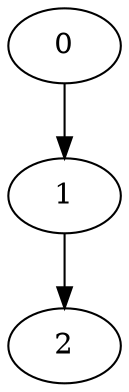

# I/O 与图统计模块 (`io`)

> **版本**: v0.1.0 | **状态**: 稳定 | **测试**: 42 通过

mbtgraph 的**数据交换与可视化桥梁层**，提供图数据的序列化/反序列化能力和统计分析工具：

- **DOT 格式** — Graphviz 兼容的图描述语言，支持导出可视化
- **JSON 格式** — 轻量级数据交换格式，支持与 Python NetworkX 等生态互操作
- **图统计** — 节点数、边数、密度、度分布、连通分量等基本指标
- **图度量** — 直径、半径、Wiener 指数、网络效率、聚类系数等高级指标

## 模块定位

```
┌─────────────┐     DOT/JSON      ┌──────────────┐
│  mbtgraph   │ ◄──────────────► │  外部系统     │
│  (内部存储)  │    序列化/反序列化 │ (Graphviz/   │
│             │                   │  NetworkX/   │
└──────┬──────┘                   │  自定义工具) │
       │                          └──────────────┘
       ▼
┌─────────────┐
│  统计分析    │  ← 图度量 + 基本统计 + 度分布
└─────────────┘
```

**核心价值**:
1. **数据交换**: 打破图算法库的信息孤岛，支持跨语言/跨工具的数据流转
2. **可视化输出**: 一行代码导出 DOT → Graphviz 渲染 PNG/SVG/PDF
3. **质量评估**: 全面的统计和度量指标，支撑算法选型和结果验证

## 依赖

| 包 | 用途 |
|---|------|
| [`@core`](../core/) | 类型定义 (NodeId, GraphReadable, GraphWritable) |
| [`@storage`](../storage/) | 存储实现 (用于测试和示例) |

## 文件结构

```
lib/io/
├── moon.pkg              # 包配置
├── types.mbt             # IOError / GraphStats / ConnectivityStats / DegreeDistribution
├── dot.mbt               # DOT 格式读写 (Graphviz 兼容)
├── json_serializer.mbt   # JSON 格式序列化/反序列化
├── graph_stats.mbt       # 基本统计: 密度/度分布/连通分量
├── graph_metrics.mbt     # 高级度量: 直径/Wiener指数/网络效率/聚类系数
└── io_test.mbt           # 集成测试 (42 tests)
```

## API 总览

### 错误类型 ([types.mbt](types.mbt))

#### `IOError` — I/O 操作错误

```moonbit
pub(all) enum IOError {
  ParseError(String)          // 解析错误（语法不合法）
  UnsupportedFormat(String)   // 不支持的格式
  InvalidData(String)         // 数据无效（语义错误）
}
```

#### `GraphStats` — 基本统计信息

```moonbit
pub(all) struct GraphStats {
  node_count : Int            // 节点总数
  edge_count : Int            // 边总数
  is_directed : Bool          // 是否有向图
  density : Double            // 图密度 ∈ [0, 1]
  avg_degree : Double         // 平均度数
  min_degree : Int            // 最小度数
  max_degree : Int            // 最大度数
  self_loop_count : Int       // 自环数量
}
```

#### `ConnectivityStats` — 连通性信息

```moonbit
pub(all) struct ConnectivityStats {
  component_count : Int                // 连通分量数
  largest_component_size : Int         // 最大分量大小
  component_sizes : Array[Int]         // 各分量大小列表
}
```

#### `DegreeDistribution` — 度分布直方图

```moonbit
pub(all) struct DegreeDistribution {
  min_degree : Int            // 最小度值
  max_degree : Int            // 最大度值
  histogram : Array[Int]      // 直方图（按度值索引）
}
```

#### `DistanceMetrics` — 距离度量 ([graph_metrics.mbt](graph_metrics.mbt))

```moonbit
pub(all) struct DistanceMetrics {
  diameter : Int              // 直径（最长最短路径）
  radius : Int                // 半径（最小离心率）
  wiener_index : Int          // Wiener 指数
  avg_path_length : Double    // 平均最短路径长度
}
```

#### `NetworkEfficiency` — 网络效率 ([graph_metrics.mbt](graph_metrics.mbt))

```moonbit
pub(all) struct NetworkEfficiency {
  global_efficiency : Double  // 全局效率 E_glob
  local_efficiency : Double   // 局部效率均值
}
```

#### `TriadCount` — 三元组计数 ([graph_metrics.mbt](graph_metrics.mbt))

```moonbit
pub(all) struct TriadCount {
  open_triads : Int           // 开放三元组数
  closed_triads : Int         // 闭合三元组数（三角形）
  global_clustering : Double  // 全局聚类系数
}
```

### DOT 格式 ([dot.mbt](dot.mbt))

**Graphviz DOT 语言** 的完整读写实现，支持有向图 (`digraph`) 和无向图 (`graph`)。

| 函数 | 说明 | 返回 |
|------|------|------|
| `write_dot[G : GraphReadable](graph, name)` | 将图序列化为 DOT 字符串 | `String` |
| `parse_dot_into[G : GraphWritable](graph, dot)` | 解析 DOT 字符串并构建到图中 | `Result[Unit, IOError]` |

**支持的 DOT 语法子集**:



**Token 类型** (`DotToken` 枚举):

| Token | 含义 |
|-------|------|
| `Ident(String)` | 标识符（关键字/图名） |
| `Number(Int)` | 整数字面量（节点 ID） |
| `Arrow` | 有向边操作符 `->` |
| `EdgeOp` | 无向边操作符 `--` |
| `LBrace` / `RBrace` | 左右花括号 `{` `}` |
| `LBracket` / `RBracket` | 左右方括号 `[` `]` |
| `Equals` | 等号 `=` |
| `Semicolon` | 分号 `;` |
| `Eof` | 输入结束 |

### JSON 格式 ([json_serializer.mbt](json_serializer.mbt))

**轻量级 JSON 序列化**，设计为与 Python NetworkX 的 `node_link_data` 格式兼容。

| 函数 | 说明 | 返回 |
|------|------|------|
| `graph_to_json[G : GraphReadable](graph, pretty)` | 将图序列化为 JSON 字符串 | `String` |
| `parse_json_into[G : GraphWritable](graph, json)` | 解析 JSON 并构建到图中 | `Result[Unit, IOError]` |

**输出的 JSON Schema**:

```json
{
  "mbtgraph": "1.0",
  "directed": true,
  "nodes": [0, 1, 2, ...],
  "edges": [
    { "source": 0, "target": 1, "weight": 1.0 },
    { "source": 1, "target": 2, "weight": 2.5 }
  ]
}
```

**字段说明**:

| 字段 | 类型 | 必填 | 说明 |
|------|------|:----:|------|
| `mbtgraph` | string | ✅ | 版本标识（当前 `"1.0"`），用于格式识别 |
| `directed` | boolean | ✅ | 是否有向图 |
| `nodes` | int[] | ✅ | 节点 ID 列表 |
| `edges` | object[] | ✅ | 边列表，每条边含 source/target/weight |

### 图统计 ([graph_stats.mbt](graph_stats.mbt))

基于 `GraphReadable` trait 的泛型统计函数，适用于所有存储类型。

| 函数 | 说明 | 返回 |
|------|------|------|
| `basic_stats[G : GraphReadable](graph)` | 计算基本统计信息 | `GraphStats` |
| `degree_distribution[G : GraphReadable](graph)` | 计算度分布直方图 | `DegreeDistribution` |
| `connectivity_stats[G : GraphReadable](graph)` | BFS 计算连通分量 | `ConnectivityStats` |

### 图度量 ([graph_metrics.mbt](graph_metrics.mbt))

高级图论度量指标，用于网络分析和质量评估。

| 函数 | 说明 | 返回 |
|------|------|------|
| `distance_metrics[G : GraphReadable](graph)` | 直径/半径/Wiener 指数/平均路径长度 | `DistanceMetrics` |
| `network_efficiency[G : GraphReadable](graph)` | 全局效率 + 局部效率 | `NetworkEfficiency` |
| `triad_counting[G : GraphReadable](graph)` | 三元组计数 + 全局聚类系数 | `TriadCount` |

## 使用示例

### 场景一：Graphviz 可视化导出

将 mbtgraph 的图导出为 DOT 格式，用 Graphviz 渲染为 PNG：

```moonbit
// 构建有向图
let g = @storage.new_directed()
@core.GraphWritable::add_node(g, 0.0) |> ignore
@core.GraphWritable::add_node(g, 1.0) |> ignore
@core.GraphWritable::add_node(g, 2.0) |> ignore
@core.GraphWritable::add_edge(g, @core.NodeId(0), @core.NodeId(1), 1.0) |> ignore
@core.GraphWritable::add_edge(g, @core.NodeId(1), @core.NodeId(2), 2.5) |> ignore

// 导出 DOT
let dot_string = write_dot(g, "MyGraph")
// 输出:
// digraph MyGraph {
//     0 -> 1 [weight=1];
//     1 -> 2 [weight=2.5];
// }

// 写入文件后用 Graphviz 渲染:
// $ dot -Tpng output.dot -o output.png
```

### 场景二：与 Python NetworkX 数据交换

通过 JSON 格式实现跨语言数据互操作：

```moonbit
// MoonBit 端：导出 JSON
let g = @storage.new_directed()
@core.GraphWritable::add_node(g, 0.0) |> ignore
@core.GraphWritable::add_node(g, 1.0) |> ignore
@core.GraphWritable::add_edge(g, @core.NodeId(0), @core.NodeId(1), 3.14) |> ignore

let json_str = graph_to_json(g, true)

// Python 端接收：
// import json, networkx as nx
// data = json.loads(json_str)
// G = nx.DiGraph()
// G.add_nodes_from(data['nodes'])
// G.add_weighted_edges_from([
//     (e['source'], e['target'], e['weight'])
//     for e in data['edges']
// ])
```

**反向导入**（Python → MoonBit）:

```python
# Python 端导出
# data = nx.node_link_data(G)
# json.dump(data, open('graph.json', 'w'))
```

```moonbit
// MoonBit 端导入
let json_content = read_file("graph.json")  // 假设有文件读取函数
let g = @storage.new_directed()
match parse_json_into(g, json_content) {
  Ok(_) => println("导入成功: " + @core.GraphReadable::node_count(g).to_string() + " 节点")
  Err(e) => println("导入失败: " + IOError::to_string(e))
}
```

### 场景三：批量统计分析报告

对多个图进行全面的统计分析：

```moonbit
fn generate_report[G : @core.GraphReadable](graph : G, name : String) -> String {
  let stats = basic_stats(graph)
  let degree = degree_distribution(graph)
  let conn = connectivity_stats(graph)
  let dist = distance_metrics(graph)
  let eff = network_efficiency(graph)
  let triad = triad_counting(graph)

  "=== " + name + " ===\n" +
  "节点数: " + stats.node_count.to_string() +
  " | 边数: " + stats.edge_count.to_string() +
  " | 密度: " + stats.density.to_string() + "\n" +
  "平均度: " + stats.avg_degree.to_string() +
  " | 度范围: [" + stats.min_degree.to_string() + ", " + stats.max_degree.to_string() + "]\n" +
  "直径: " + dist.diameter.to_string() +
  " | 半径: " + dist.radius.to_string() +
  " | Wiener指数: " + dist.wiener_index.to_string() + "\n" +
  "全局效率: " + eff.global_efficiency.to_string() +
  " | 局部效率: " + eff.local_efficiency.to_string() + "\n" +
  "聚类系数: " + triad.global_clustering.to_string() +
  " | 分量数: " + conn.component_count.to_string() + "\n"
}

// 使用
let report = generate_report(g, "社交网络图")
println(report)
```

### 场景四：错误处理模式

完整的 IOError 匹配和处理：

```moonbit
// DOT 解析错误处理
let dot_input = "invalid dot content {"
let g = @storage.new_directed()
match parse_dot_into(g, dot_input) {
  Ok(_) => println("解析成功")
  Err(IOError::ParseError(msg)) => {
    println("语法错误: " + msg)
    // 提示用户检查 DOT 格式
  }
  Err(IOError::UnsupportedFormat(msg)) => {
    println("不支持的功能: " + msg)
    // 如: 子图/属性节点等未实现的 DOT 特性
  }
  Err(IOError::InvalidData(msg)) => {
    println("数据无效: " + msg)
    // 如: 节点 ID 越界/权重非法
  }
}

// JSON 解析同理
match parse_json_into(g, "{ invalid }") {
  Ok(_) => ()
  Err(e) => println("JSON 错误: " + IOError::to_string(e))
}
```

### 场景五：往返一致性验证 (Round-trip)

确保序列化和反序列化的数据完整性：

```moonbit
// DOT 往返测试
let original = make_complex_graph()
let dot_str = write_dot(original, "RoundTrip")
let restored = @storage.new_directed()
match parse_dot_into(restored, dot_str) {
  Ok(_) => {
    assert_eq(
      @core.GraphReadable::node_count(restored),
      @core.GraphReadable::node_count(original),
    )
    assert_eq(
      @core.GraphReadable::edge_count(restored),
      @core.GraphReadable::edge_count(original),
    )
    println("DOT round-trip ✓")
  }
  Err(e) => println("Round-trip 失败: " + IOError::to_string(e))
}

// JSON 往返测试（同理）
let json_str = graph_to_json(original, false)
let restored2 = @storage.new_directed()
let _ = parse_json_into(restored2, json_str)
// 验证节点数和边数一致...
```

## 算法原理

### DOT 语法规范

本模块实现了 **DOT 语言的核心子集**，兼容 Graphviz 工具链：

```
Graph        := ('digraph' | 'graph') [ID] '{' StmtList '}'
StmtList     := Stmt (';' Stmt)*
Stmt         := NodeStmt | EdgeStmt
NodeStmt     := ID
EdgeStmt     := ID ('->' | '--') ID [AttrList]
AttrList     := '[' ID '=' Value ']'
Comment      := '//' ... '\n' | '#' ... '\n' | '/'* ... '*' '/'
```

**词法分析器架构**:

```
输入字符串 → skip_comments_and_space → next_token_and_state → DotToken 流
                                         ↓
                                    状态机驱动:
                                    - 空白跳过
                                    - 注释过滤 (3 种风格)
                                    - 操作符识别 (-> / --)
                                    - 数字/标识符/字符串解析
```

**解析器特点**:
- **增量式**: 单遍扫描，无 AST 中间表示
- **容错**: 自动跳过无法识别的 token
- **自动建节点**: 遇到边的端点时自动创建节点（若不存在）

### JSON Schema 设计

采用 **扁平化 node-link** 结构，权衡了可读性和解析复杂度：

```json
{
  "mbtgraph": "1.0",        // 格式版本标识
  "directed": true/false,    // 有向/无向标志
  "nodes": [0, 1, 2],       // 节点 ID 数组（紧凑）
  "edges": [                 // 边对象数组
    {"source": 0, "target": 1, "weight": 1.0}
  ]
}
```

**设计决策**:
1. **不含元数据**: 不存储节点标签/颜色等，保持简洁
2. **整数节点 ID**: 与 mbtgraph 的 `NodeId(Int)` 对齐
3. **weight 必填**: 统一使用加权边模型
4. **pretty 可选**: 支持紧凑模式和美化输出

**对比 NetworkX `node_link_data`**:

| 特性 | mbtgraph JSON | NetworkX |
|------|:------------:|:--------:|
| 节点属性 | ❌ 仅 ID | ✅ 支持 |
| 边属性 | 仅 weight | ✅ 任意 key-value |
| 有向标志 | ✅ directed | ❌ 需推断 |
| 格式标识 | ✅ mbtgraph | ❌ |
| 可读性 | ✅ pretty 选项 | 取决于参数 |

### 统计指标数学定义

#### 图密度 (Density)

$$\rho = \frac{|E|}{|E_{max}|} = \begin{cases} \frac{m}{n(n-1)} & \text{有向图} \\ \frac{2m}{n(n-1)} & \text{无向图} \end{cases}$$

- $\rho = 0$: 空图（无边）
- $\rho = 1$: 完全图
- 实际网络通常 $\rho \ll 1$（稀疏）

#### Wiener 指数 (Wiener Index)

$$W(G) = \sum_{i < j} d(i,j)$$

其中 $d(i,j)$ 是节点 $i$ 和 $j$ 之间的最短路径长度。

- 衡量图的"紧凑程度"
- 值越小，图越紧凑
- 用于化学图论（分子分支度）

#### 全局效率 (Global Efficiency)

$$E_{glob} = \frac{1}{n(n-1)} \sum_{i \neq j} \frac{1}{d(i,j)}$$

- 衡量网络信息传输效率
- $E_{glob} = 1$: 完全图（任意两点直达）
- 不连通节点对贡献 0

#### 局部效率 (Local Efficiency)

$$E_{loc}(i) = \frac{1}{k_i(k_i-1)} \sum_{j,h \in N(i)} \frac{1}{d_{G[N(i)]}(j,h)}$$

其中 $N(i)$ 是节点 $i$ 的邻居集合，$d_{G[N(i)]}$ 是在邻居子图中的距离。

- 衡量节点的 fault-tolerance 能力
- 高局部效率 → 邻居之间连接紧密

#### 全局聚类系数 (Global Clustering Coefficient)

$$C = \frac{3 \times \text{三角形数}}{\text{连通三元组数}}$$

- $C = 1$: 完全聚类（所有邻居互联）
- 社交网络典型值: 0.1 ~ 0.5
- 小世界网络的标志性特征

## 内部组件

### DOT 解析器组件 ([dot.mbt](dot.mbt))

| 组件 | 可见性 | 功能 |
|------|:------:|------|
| `DotParserState` | priv | 解析器状态（输入串 + 位置 + 长度） |
| `advance()` | priv | 推进位置（带边界检查） |
| `code_at()` | priv | 读取偏移处字符码 |
| `skip_whitespace()` | priv | 跳过空白字符 (space/tab/CR/LF) |
| `skip_comment()` | priv | 跳过三种注释风格 (// # /**/) |
| `skip_comments_and_space()` | priv | 循环跳过空白+注释 |
| `next_token_and_state()` | priv | 词法分析主循环，返回下一个 token |
| `parse_edge_attributes()` | priv | 解析边属性 `[key=value]` |
| 字符分类函数 ×4 | priv | is_space_code/is_digit_code/is_ident_start/is_ident_cont |

### JSON 解析器组件 ([json_serializer.mbt](json_serializer.mbt))

| 组件 | 可见性 | 功能 |
|------|:------:|------|
| `json_is_digit_or_dot()` | priv | 检测数字/小数点/负号 |
| `json_skip_space()` | priv | 跳过 JSON 空白字符 |
| `json_match_keyword()` | priv | 匹配 true/false/null 关键字 |

### 统计计算组件 ([graph_stats.mbt](graph_stats.mbt))

| 组件 | 可见性 | 功能 |
|------|:------:|------|
| `array_push()` | priv | 不可变数组追加（深拷贝语义） |

### 度量计算组件 ([graph_metrics.mbt](graph_metrics.mbt))

| 组件 | 可见性 | 功能 |
|------|:------:|------|
| `graph_metrics_bfs()` | priv | 单源 BFS 最短距离数组 |
| `graph_metrics_bfs_with_exclude()` | priv | BFS 排除指定节点（局部效率用） |
| `build_triad_adjacency()` | priv | 构建去重邻接表（三元组计数用） |
| `has_edge_triad()` | priv | 邻接表中边存在检查 |

## 边界行为

### DOT 解析边界

| 条件 | 行为 | 返回 |
|------|------|------|
| 空字符串 | 正常处理 | `Ok(())` （空图） |
| 仅含注释 | 跳过注释 | `Ok(())` （空图） |
| 无效关键字 (如 `digraphh`) | 词法阶段拒绝 | `Err(ParseError(...))` |
| 缺少 `{` | 语法阶段拒绝 | `Err(ParseError(...))` |
| 边目标非数字 | 语法阶段拒绝 | `Err(ParseError(...))` |
| 无名图 (省略 ID) | 允许 | `Ok(())` （name=""） |
| 已存在的图 | 追加模式 | 合并到现有图 |
| 超大图 (>10K 节点) | 正常处理 | O(n+m) 时间/空间 |
| 非 ASCII 节点名 | 作为 Ident 处理 | 可能丢失精度 |

### JSON 解析边界

| 条件 | 行为 | 返回 |
|------|------|------|
| 空 `{}` | 正常处理 | `Ok(())` （空图） |
| 缺少 `nodes` 字段 | 跳过 | 无节点 |
| 缺少 `edges` 字段 | 跳过 | 无边 |
| 未知字段 | 静默忽略 | 向前兼容 |
| weight 为负数 | 正常接受 | 保留原值 |
| 浮点权重 | 正常解析 | 支持小数 |
| 非 JSON 输入 | 快速失败 | `Err(ParseError("Expected JSON object"))` |
| 已存在的图 | 追加模式 | 合并到现有图 |

### 统计计算边界

| 条件 | 行为 | 返回值 |
|------|------|--------|
| 空图 (n=0) | 安全处理 | 所有计数值 = 0，density = 0.0 |
| 单节点图 (n=1) | 安全处理 | diameter/radius/wiener = 0 |
| 不连通图 | 分别计算各分量 | distance_metrics 仅覆盖可达对 |
| 自环 | 计入 self_loop_count | 影响度数但不影响密度公式修正 |
| 多重边 | 每条边独立计入 | edge_count 包含重复边 |

## 测试覆盖

| 类别 | DOT | JSON | Stats | Metrics | 内容 |
|------|:---:|:----:|:-----:|:-------:|------|
| 序列化 (写) | 5 | 4 | — | — | 有向/无向/自定义名/单节点/空图/pretty |
| 解析 (读) | 10 | 4 | — | — | 基本/权重/无名/注释(3种)/多边/错误/已存在 |
| 往返一致性 | 5 | 4 | — | — | 有向/无向/链状/单节点/空图/pretty |
| 基本统计 | — | — | 4 | — | 有向/无向/空图/单节点 |
| 度分布 | — | — | 3 | — | 均匀/空图/单节点 |
| 连通性 | — | — | 3 | — | 链状/空图/双分量 |
| 距离度量 | — | — | — | 3 | P4 路径/空图/单节点 |
| 网络效率 | — | — | — | 3 | P4 路径/空图/单节点 |
| 三元组计数 | — | — | — | 4 | 三角形/P4/空图/K4 |
| **合计** | **20** | **12** | **10** | **13** | **55** |

运行命令:
```bash
moon test lib/io  # 55 tests (20 DOT + 12 JSON + 10 Stats + 13 Metrics)
```

**往返测试 (Round-trip)** 是本模块的核心质量保证手段：

```moonbit
// 保证: serialize(deserialize(serialize(G))) == serialize(G)
let dot1 = write_dot(original, "G")
let _ = parse_dot_into(temp, dot1)
let dot2 = write_dot(temp, "G")
// dot1 应包含与 dot2 相同的结构信息
```

## 设计决策

### 为什么选择 DOT + JSON 双格式？

| 维度 | DOT | JSON |
|------|-----|------|
| **主要用途** | 可视化渲染 | 数据交换 |
| **生态兼容** | Graphviz 全家桶 | Python/JS/Web |
| **人类可读** | ⭐⭐⭐⭐⭐ | ⭐⭐⭐⭐ |
| **机器解析** | 需专用解析器 | 原生支持 |
| **表达能力** | 丰富（子图/样式/布局） | 简洁（纯数据） |
| **典型场景** | 导出 PNG/SVG/PDF | 与 NetworkX 互操作 |

**结论**: 两种格式互补而非竞争——DOT 面向**人眼+渲染引擎**，JSON 面向**程序间通信**。

### 为什么自实现 JSON 解析器而非引入库？

1. **零依赖**: 保持 io 模块轻量，不增加外部依赖
2. **可控性**: 只需支持图数据的有限 schema，不需要完整 JSON 规范
3. **性能**: 手写递降解析器针对特定模式优化
4. **教育价值**: 展示 MoonBit 的字符串处理能力

### 错误处理策略：Result vs Panic？

统一使用 `Result<Unit, IOError>` 返回错误，**不使用 panic**：

```moonbit
// ✅ 推荐：让调用者决定如何处理错误
match parse_dot_into(g, input) {
  Ok(_) => process_graph(g)
  Err(e) => log_error(e)
}

// ❌ 避免：内部 panic 导致不可恢复
// parse_dot_into 内部遇到错误直接 panic
```

**原因**:
1. **可组合性**: 错误可以传播、转换、聚合
2. **可测试性**: 错误路径是显式的，易于编写测试
3. **生产安全**: 解析外部输入必须容错

### 统计函数为什么是泛型的？

所有统计函数签名均为 `pub fn[G : @core.GraphReadable]`，而非绑定特定存储类型：

```moonbit
// 泛型版本 — 适用于全部 8 种存储
pub fn[G : @core.GraphReadable] basic_stats(graph : G) -> GraphStats { ... }

// 如果写成这样 — 只能用于 DirectedAdjList
pub fn basic_stats(graph : DirectedAdjList) -> GraphStats { ... }
```

**好处**:
1. **统一接口**: 用户无需关心底层存储差异
2. **向前兼容**: 新增存储类型自动获得统计能力
3. **Trait 约束**: 编译期保证只使用只读操作

## 与其他模块配合

### 从算法模块导出结果

```moonbit
// 运行最短路径算法后，导出结果图
let result = dijkstra(graph, source)
let dot = write_dot(result.predecessor_tree, "shortest_path_tree")

// 运行最大流后，导出流网络
let flow_result = dinic(flow_net, s, t)
let stats = basic_stats(/* 从 flow_net 转换 */)
```

### 从存储模块构建后立即分析

```moonbit
// 构建随机图后立即分析
let random_g = generate_erdos_renyi(100, 0.05)
let stats = basic_stats(random_g)
let metrics = distance_metrics(random_g)
println("密度: " + stats.density.to_string())
println("直径: " + metrics.diameter.to_string())
```

### 批量导入外部图数据集

```moonbit
// 从文件批量导入
let files = ["graph1.json", "graph2.json", "graph3.json"]
for file in files {
  let content = read_file(file)
  let g = @storage.new_directed()
  match parse_json_into(g, content) {
    Ok(_) => {
      let report = generate_stats_report(g, file)
      println(report)
    }
    Err(e) => println(file + ": 导入失败 - " + IOError::to_string(e))
  }
}
```

## 性能参考

| 操作 | 时间复杂度 | 空间复杂度 | 备注 |
|------|-----------|-----------|------|
| `write_dot` | O(V + E) | O(E) (输出缓冲) | 遍历所有边一次 |
| `parse_dot_into` | O(V + E) | O(V) (token 暂存) | 单遍扫描 |
| `graph_to_json` | O(V + E) | O(E) (输出缓冲) | 同上 |
| `parse_json_into` | O(V + E) | O(1) | 增量解析 |
| `basic_stats` | O(V + E) | O(1) | 遍历节点+边各一次 |
| `degree_distribution` | O(V) | O(V) | 收集度数+构建直方图 |
| `connectivity_stats` | O(V + E) | O(V) | BFS 遍历 |
| `distance_metrics` | O(V(V + E)) | O(V) | V 次 BFS |
| `network_efficiency` | O(V²(V + E)) | O(V) | V 次 BFS + V 次子图 BFS |
| `triad_counting` | O(V · d²) | O(V · d) | d = 平均度数 |

## 已知限制

| 限制 | 影响 | 未来计划 |
|------|------|---------|
| DOT 不支持子图 (subgraph) | 无法表达层级结构 | 可选实现 |
| DOT 不支持节点/边样式属性 | 渲染效果受限 | 可扩展 AttrList 解析 |
| JSON 不支持节点/边元数据 | 信息丢失 | 可扩展 schema |
| 不支持从文件直接读写的 IO 函数 | 需要外部文件读取 | 依赖 MoonBit 标准 IO |
| distance_metrics 对不连通图仅计算可达对 | Wiener 按惯例处理 | 可选返回完整矩阵 |
| network_efficiency 在稠密图上较慢 (O(V³)) | 大图性能问题 | 可选近似算法 |

## 版本历史

| 版本 | 日期 | 变更 |
|:----:|:----:|------|
| v0.1.0 | 2026-06-01 | 初始版本：DOT 读写 + JSON 序列化 + 图统计 + 图度量 + 55 tests |
