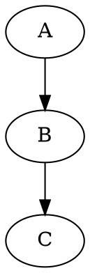

# 🚧 内容建设中...

## 序列化与反序列化

<div class="callout" data-color="caution">
  <div class="callout-header">
    <span class="callout-icon">⚠️</span>
    <p class="callout-title">正在建设中</p>
  </div>
  <div class="callout-content">
    <p><strong>预计完成时间：</strong>2026 年 7 月下旬</p>
    <p><strong>内容概要：</strong></p>
    <ul>
      <li>DOT 格式读写（Graphviz 兼容）</li>
      <li>JSON 格式序列化</li>
      <li>自定义序列化方案</li>
      <li>大图处理策略（流式、分块）</li>
      <li>版本兼容性考虑</li>
    </ul>
    <p>在此期间，可以先了解 IO 模块的 <a href="/api/io/">API 文档</a>。</p>
  </div>
</div>

## 支持的格式

### DOT 格式（Graphviz）



### JSON 格式

```json
{
  "mbtgraph": "1.0",
  "directed": true,
  "node_count": 2,
  "edge_count": 1,
  "nodes": [0, 1],
  "edges": [
    {"source": 0, "target": 1, "weight": 1.0}
  ]
}
```

---

**相关文档：**
- [图的读写操作](/core-concepts/graph-operations/)
- [IO 模块接口](/api/io/)
- [实战案例 - 知识图谱](/use-cases/knowledge-graph/extraction/)
