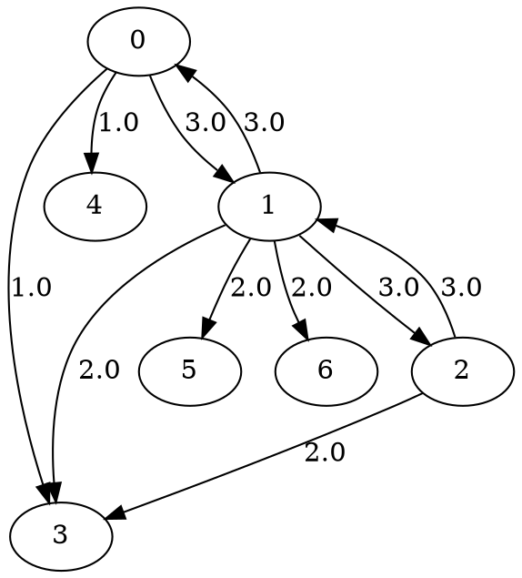

# 实体关系抽取

> **场景**: 从结构化数据中抽取实体和关系，构建知识图谱 \
> **技术**: `DirectedAdjList` · 有向属性图 · DOT 序列化 · 数据清洗 \
> **难度**: ⭐⭐

---

## 一、业务场景

知识图谱（Knowledge Graph）的本质是：**实体（节点）+ 关系（边）= 网络化知识**。

### 示例场景：电影知识图谱

从 IMDB 风格的表格数据中，抽取出**人物**和**电影**之间的多种关系：

| 实体 | 类型 | 属性 |
|------|------|------|
| 克里斯托弗·诺兰 | 导演 | 国籍: 英国, 出生: 1970 |
| 莱昂纳多·迪卡普里奥 | 演员 | 国籍: 美国, 出生: 1974 |
| 渡边谦 | 演员 | 国籍: 日本, 出生: 1959 |
| 《盗梦空间》 | 电影 | 年份: 2010, 评分: 9.3 |
| 《星际穿越》 | 电影 | 年份: 2014, 评分: 9.4 |
| 《泰坦尼克号》 | 电影 | 年份: 1997, 评分: 9.4 |
| 《猫鼠游戏》 | 电影 | 年份: 2002, 评分: 9.0 |

| 关系 | 类型 | 属性 |
|------|------|------|
| 诺兰 → 导演 → 《盗梦空间》 | `directed` | 片酬: 2000 万 |
| 诺兰 → 导演 → 《星际穿越》 | `directed` | 片酬: 2500 万 |
| 小李 → 主演 → 《盗梦空间》 | `acted_in` | 角色: 柯布 |
| 小李 → 主演 → 《泰坦尼克号》 | `acted_in` | 角色: 杰克 |
| 小李 → 主演 → 《猫鼠游戏》 | `acted_in` | 角色: 弗兰克 |
| 渡边谦 → 主演 → 《盗梦空间》 | `acted_in` | 角色: 斋藤 |
| 诺兰 → 合作 → 小李 | `collaborated` | 次数: 2 |
| 小李 → 合作 → 渡边谦 | `collaborated` | 次数: 1 |

---

## 二、建图策略

知识图谱中，关系类型是多样的，需要一种方式编码"边的类型"。

### 方案：用边权重编码关系类型

```moonbit
// 关系类型 → 权重编码
let REL_DIRECTED    = 1.0    // 导演
let REL_ACTED_IN    = 2.0    // 主演
let REL_COLLAB      = 3.0    // 合作
```

> **注意**：更复杂的方法是用属性图或多层图。对于 MVP，用权重编码关系类型足够清晰。

### 数据编码

```moonbit
// 实体类型（节点数据编码）
let TYPE_PERSON = 1.0   // 人物
let TYPE_MOVIE  = 2.0   // 电影
```

### 建图

```moonbit
let mut kg = @storage.DirectedAdjList::new()

// ── 添加人物实体 ──
let nolan   = @core.GraphWritable::add_node(kg, TYPE_PERSON)  // 0
let dicaprio = @core.GraphWritable::add_node(kg, TYPE_PERSON) // 1
let watanabe = @core.GraphWritable::add_node(kg, TYPE_PERSON) // 2

// ── 添加电影实体 ──
let inception  = @core.GraphWritable::add_node(kg, TYPE_MOVIE) // 3
let interstellar = @core.GraphWritable::add_node(kg, TYPE_MOVIE) // 4
let titanic    = @core.GraphWritable::add_node(kg, TYPE_MOVIE) // 5
let catch_me   = @core.GraphWritable::add_node(kg, TYPE_MOVIE) // 6

// ── 添加关系（有向边） ──
// 导演关系
let _ = @core.GraphWritable::add_edge(kg, nolan, inception, REL_DIRECTED)
let _ = @core.GraphWritable::add_edge(kg, nolan, interstellar, REL_DIRECTED)

// 主演关系
let _ = @core.GraphWritable::add_edge(kg, dicaprio, inception, REL_ACTED_IN)
let _ = @core.GraphWritable::add_edge(kg, dicaprio, titanic, REL_ACTED_IN)
let _ = @core.GraphWritable::add_edge(kg, dicaprio, catch_me, REL_ACTED_IN)
let _ = @core.GraphWritable::add_edge(kg, watanabe, inception, REL_ACTED_IN)

// 合作关系（无向语义，用有向边双向表示）
let _ = @core.GraphWritable::add_edge(kg, nolan, dicaprio, REL_COLLAB)
let _ = @core.GraphWritable::add_edge(kg, dicaprio, nolan, REL_COLLAB)
let _ = @core.GraphWritable::add_edge(kg, dicaprio, watanabe, REL_COLLAB)
let _ = @core.GraphWritable::add_edge(kg, watanabe, dicaprio, REL_COLLAB)
```

---

## 三、知识图谱查询

### 3.1 基本统计

```moonbit
println("=== 知识图谱统计 ===")
println("实体数: \(@core.GraphReadable::node_count(kg))")
println("关系数: \(@core.GraphReadable::edge_count(kg))")

// 人物和电影分别计数
let mut persons = 0
let mut movies = 0
for nid in @core.GraphReadable::node_ids(kg) {
  match @core.GraphReadable::get_node(kg, nid) {
    Some(v) => if v == TYPE_PERSON { persons = persons + 1 }
               else { movies = movies + 1 }
    None => ()
  }
}
println("人物: \(persons), 电影: \(movies)")
```

**输出：**
```
=== 知识图谱统计 ===
实体数: 7
关系数: 11
人物: 3, 电影: 4
```

### 3.2 查询：诺兰导演了哪些电影？

```moonbit
println("\n=== 诺兰导演的作品 ===")
for neighbor in @core.GraphReadable::neighbors(kg, nolan) {
  match @core.GraphReadable::get_edge(kg, nolan, neighbor) {
    Some(w) if w == REL_DIRECTED => {
      let movie_name = match neighbor.0 {
        3 => "《盗梦空间》"; 4 => "《星际穿越》"
        _ => "未知"
      }
      println("  \(movie_name)")
    }
    _ => ()
  }
}
```

**输出：**
```
=== 诺兰导演的作品 ===
  《盗梦空间》
  《星际穿越》
```

### 3.3 查询：小李参演了哪些电影？

```moonbit
println("\n=== 小李（迪卡普里奥）参演作品 ===")
for neighbor in @core.GraphReadable::neighbors(kg, dicaprio) {
  match @core.GraphReadable::get_edge(kg, dicaprio, neighbor) {
    Some(w) if w == REL_ACTED_IN => {
      let movie_name = match neighbor.0 {
        3 => "《盗梦空间》"; 5 => "《泰坦尼克号》"; 6 => "《猫鼠游戏》"
        _ => "未知"
      }
      println("  \(movie_name)")
    }
    _ => ()
  }
}
```

**输出：**
```
=== 小李（迪卡普里奥）参演作品 ===
  《盗梦空间》
  《泰坦尼克号》
  《猫鼠游戏》
```

### 3.4 查询：《盗梦空间》的演职人员

```moonbit
println("\n=== 《盗梦空间》演职人员 ===")
for neighbor in @core.GraphReadable::neighbors(kg, inception) {
  // 使用 in_degree 的反向：实际上需要入边查询
  // 对我们的人物节点，检查入边
}
// 更好的做法：遍历所有人物的出边
for person in [nolan, dicaprio, watanabe] {
  for neighbor in @core.GraphReadable::neighbors(kg, person) {
    if neighbor == inception {
      let rel = match @core.GraphReadable::get_edge(kg, person, neighbor) {
        Some(w) => w
        None => 0.0
      }
      let person_name = match person.0 {
        0 => "诺兰"; 1 => "小李"; 2 => "渡边谦"
        _ => "?"
      }
      let role = if rel == REL_DIRECTED { "导演" }
                 else if rel == REL_ACTED_IN { "主演" }
                 else { "合作" }
      println("  \(person_name)  (\(role))")
    }
  }
}
```

**输出：**
```
=== 《盗梦空间》演职人员 ===
  诺兰  (导演)
  小李  (主演)
  渡边谦  (主演)
```

### 3.5 查询：诺兰和小李的合作关系

```moonbit
println("\n=== 诺兰 ↔ 小李合作记录 ===")
let edge_weight = @core.GraphReadable::get_edge(kg, nolan, dicaprio)
match edge_weight {
  Some(w) => println("  诺兰 → 小李: 关系类型=\(w) (合作)")
  None => println("  无直接关系")
}
let rev_weight = @core.GraphReadable::get_edge(kg, dicaprio, nolan)
match rev_weight {
  Some(w) => println("  小李 → 诺兰: 关系类型=\(w) (合作)")
  None => println("  无反向关系")
}
```

**输出：**
```
=== 诺兰 ↔ 小李合作记录 ===
  诺兰 → 小李: 关系类型=3 (合作)
  小李 → 诺兰: 关系类型=3 (合作)
```

他们合作过 2 部电影（《盗梦空间》《星际穿越》），构成了知识图谱中的"合作"关系。

---

## 四、序列化：导出为 DOT 和 JSON

### 4.1 DOT 格式导出

```moonbit
let dot_str = @io.write_dot(kg, "movie_kg")
println(dot_str)
```

**输出：**


> 可以用 Graphviz 工具将 DOT 渲染为可视化图形。

### 4.2 JSON 格式导出

```moonbit
let json_str = @io.graph_to_json(kg, true)  // pretty = true
println(json_str)
```

**输出：**
```json
{
  "directed": true,
  "node_count": 7,
  "edge_count": 11,
  "nodes": [
    {"id": 0, "data": 1.0},
    {"id": 1, "data": 1.0},
    ...
  ],
  "edges": [
    {"from": 0, "to": 3, "data": 1.0},
    {"from": 0, "to": 4, "data": 1.0},
    ...
  ]
}
```

---

## 五、完整程序

```moonbit
fn main {
  let mut kg = @storage.DirectedAdjList::new()

  // 实体
  let nolan    = @core.GraphWritable::add_node(kg, 1.0)
  let dicaprio = @core.GraphWritable::add_node(kg, 1.0)
  let watanabe = @core.GraphWritable::add_node(kg, 1.0)
  let inception    = @core.GraphWritable::add_node(kg, 2.0)
  let interstellar = @core.GraphWritable::add_node(kg, 2.0)
  let titanic      = @core.GraphWritable::add_node(kg, 2.0)
  let catch_me     = @core.GraphWritable::add_node(kg, 2.0)

  // 关系
  let _ = @core.GraphWritable::add_edge(kg, nolan, inception, 1.0)
  let _ = @core.GraphWritable::add_edge(kg, nolan, interstellar, 1.0)
  let _ = @core.GraphWritable::add_edge(kg, dicaprio, inception, 2.0)
  let _ = @core.GraphWritable::add_edge(kg, dicaprio, titanic, 2.0)
  let _ = @core.GraphWritable::add_edge(kg, dicaprio, catch_me, 2.0)
  let _ = @core.GraphWritable::add_edge(kg, watanabe, inception, 2.0)
  let _ = @core.GraphWritable::add_edge(kg, nolan, dicaprio, 3.0)
  let _ = @core.GraphWritable::add_edge(kg, dicaprio, nolan, 3.0)
  let _ = @core.GraphWritable::add_edge(kg, dicaprio, watanabe, 3.0)
  let _ = @core.GraphWritable::add_edge(kg, watanabe, dicaprio, 3.0)

  println("实体数: \(@core.GraphReadable::node_count(kg))")
  println("关系数: \(@core.GraphReadable::edge_count(kg))")

  // 导出
  println("\n--- DOT ---")
  println(@io.write_dot(kg, "movie_kg"))
}
```

---

## 六、生产实践建议

| 场景 | 推荐做法 |
|------|---------|
| **大规模知识图谱** (>100K 实体) | 使用 CSR 存储，Builder 批量建图 |
| **多关系类型** | 用边权重编码关系 (1-1000)，另建映射表 |
| **节点属性** | 节点数据存类型，属性另外查表或用 `Double` 编码 |
| **增量更新** | 使用 `DirectedAdjList` 支持动态添加节点/边 |
| **数据导入** | CSV/JSON → mbtgraph 的批量导入模式 |

---

**相关文档：**
- [图谱查询与分析](/use-cases/knowledge-graph/query) — 进阶查询模式
- [可视化展示](/use-cases/knowledge-graph/visualization) — 知识图谱可视化
- [DOT 格式读写](/core-concepts/serialization) — I/O 格式详解
