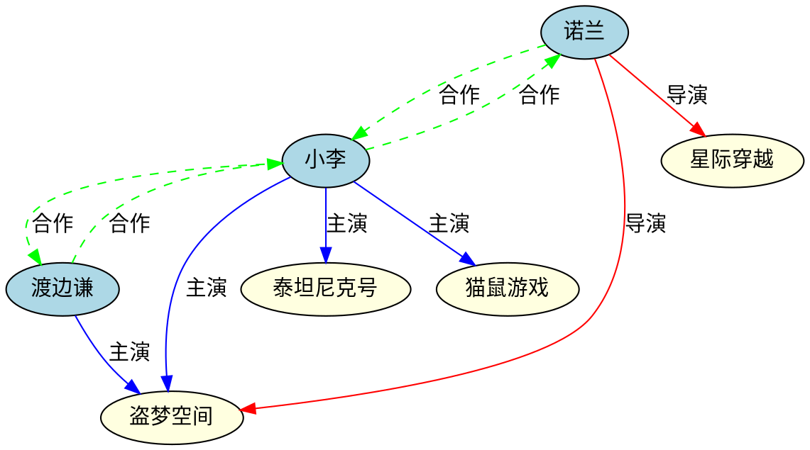

# 可视化展示

> **场景**: 将构建好的电影知识图谱以图形化方式展示，直观呈现实体间的关系 \
> **技术**: `graph_to_json` · `write_dot` · Graphviz · Cytoscape.js 可视化 \
> **前置**: 已完成[实体关系抽取](/use-cases/knowledge-graph/extraction) \
> **难度**: ⭐⭐

---

## 一、为什么需要可视化？

知识图谱的数据结构是图——而**图生来就是用来被"看"的**。纯文本的三元组列表难以直观理解：

```
文本: (诺兰, 导演, 盗梦空间), (小李, 主演, 盗梦空间) ...
```

vs 可视化:

```
                    ┌──────────┐
      ┌─────────────│  诺兰    │─────────────┐
      │              └──────────┘              │
      │ 导演               │ 合作              │ 导演
      ▼                     ▼                  ▼
  ┌──────────┐         ┌──────────┐     ┌──────────┐
  │盗梦空间  │         │  小李    │     │星际穿越  │
  └──────────┘         └──────────┘     └──────────┘
      ▲                     │
      │ 主演               │ 合作
      │                     ▼
  ┌──────────┐         ┌──────────┐
  │ 渡边谦   │         │泰坦尼克… │
  └──────────┘         └──────────┘
```

可视化不仅美观，还能帮你发现纯文本中容易遗漏的模式。

---

## 二、方法一：导出 DOT 用 Graphviz 渲染

`write_dot` 导出 DOT 格式，可以直接传递给 Graphviz 命令行工具渲染为 PNG/SVG：

```moonbit
// 导出 DOT 字符串
let dot_str = @io.write_dot(kg, "movie_kg")
println(dot_str)
```

将输出保存为 `movie_kg.dot`，然后用 Graphviz 渲染：

```bash
# 安装 Graphviz (Ubuntu)
sudo apt install graphviz

# 渲染为 PNG
dot -Tpng movie_kg.dot -o movie_kg.png

# 渲染为 SVG（可缩放矢量图，适合网页）
dot -Tsvg movie_kg.dot -o movie_kg.svg
```

### 优化 DOT 输出（添加标签和颜色）

mbtgraph 的 `write_dot` 输出基本的 DOT，你可以手动增强：



渲染效果：人物用蓝色，电影用黄色，关系用不同颜色区分。

---

## 三、方法二：导出 JSON 用于 Web 可视化

`graph_to_json` 导出的 JSON 格式可以直接被 Web 前端（如 Cytoscape.js）消费：

```moonbit
let json_str = @io.graph_to_json(kg, true)
```

输出 JSON 示例（截取）：

```json
{
  "directed": true,
  "node_count": 7,
  "edge_count": 11,
  "nodes": [
    {"id": 0, "data": 1.0},
    {"id": 1, "data": 1.0},
    {"id": 3, "data": 2.0}
  ],
  "edges": [
    {"from": 0, "to": 3, "data": 1.0},
    {"from": 0, "to": 4, "data": 1.0}
  ]
}
```

### 转换为 Cytoscape.js 格式

Cytoscape.js 是本站可视化页面使用的渲染引擎。将 JSON 转换为 Cytoscape 元素格式：

```javascript
// 在 Web 前端中
const kgJson = { ... }; // 从 MoonBit 导出的 JSON

const elements = [
  // 节点
  ...kgJson.nodes.map(n => ({
    data: {
      id: `n${n.id}`,
      label: getLabel(n.id),    // 映射为人类可读名称
      type: n.data === 1.0 ? 'person' : 'movie'
    }
  })),
  // 边
  ...kgJson.edges.map(e => ({
    data: {
      id: `e${e.from}-${e.to}`,
      source: `n${e.from}`,
      target: `n${e.to}`,
      label: getRelation(e.data),  // 1.0→导演, 2.0→主演, 3.0→合作
      weight: e.data
    }
  }))
];

// 初始化 Cytoscape
const cy = cytoscape({
  container: document.getElementById('kg-container'),
  elements: elements,
  style: [
    {
      selector: 'node[type="person"]',
      style: { 'background-color': '#3B82F6', label: 'data(label)' }
    },
    {
      selector: 'node[type="movie"]',
      style: { 'background-color': '#F59E0B', label: 'data(label)' }
    },
    {
      selector: 'edge[label="导演"]',
      style: { 'line-color': '#EF4444', label: 'data(label)' }
    },
    {
      selector: 'edge[label="主演"]',
      style: { 'line-color': '#10B981', label: 'data(label)' }
    },
    {
      selector: 'edge[label="合作"]',
      style: { 'line-color': '#8B5CF6', 'line-style': 'dashed', label: 'data(label)' }
    }
  ],
  layout: { name: 'cose' }  // 力导向布局
});
```

---

## 四、方法三：本站可视化页面

mbtgraph 文档站内置了基于 **Cytoscape.js** 的算法可视化引擎。你可以将知识图谱数据嵌入到可视化页面中：

```astro
---
// knowledge-graph.astro 示例
import VizPage from '../../components/VizPage.astro';

const statusPanelHtml = `
<div class="viz-status-item"><span class="viz-status-label">实体数</span><span class="viz-status-value">7</span></div>
<div class="viz-status-item"><span class="viz-status-label">关系数</span><span class="viz-status-value">11</span></div>
<div class="viz-status-item"><span class="viz-status-label">关系类型</span><span class="viz-status-mono">导演·主演·合作</span></div>
`;
---
<VizPage algoSlug="kg" direction="有向图" statusPanelHtml={statusPanelHtml} />
```

只需在 `algorithms.config.ts` 中注册知识图谱数据和算法模块，即可在 ⚡ 可视化页面中交互浏览知识图谱。

---

## 五、从 MoonBit 到 Web 的全链路

```
MoonBit 端                    Web 前端
─────────                   ─────────
                              ┌──────────────┐
kg → graph_to_json() ────→  │ JSON 解析     │
                              │              │
kg → write_dot() ────────→  │ Cytoscape.js  │
                              │ 渲染 + 交互   │
                              │              │
                              │ 力导向布局    │
                              │ 节点拖拽     │
                              │ 缩放/平移     │
                              └──────────────┘
```

### 完整集成示例

```moonbit
// MoonBit: 构建知识图谱 + 导出 JSON
fn export_kg() -> String {
  let mut kg = @storage.DirectedAdjList::new()
  // ... 添加节点和边 ...
  @io.graph_to_json(kg, true)
}
```

```javascript
// Web: 消费 JSON 并渲染
fetch('/api/kg.json')
  .then(r => r.json())
  .then(kgJson => {
    const cy = cytoscape({
      container: document.getElementById('kg'),
      elements: convertToCytoscape(kgJson),
      style: kgStyles,
      layout: { name: 'cose' }
    });
  });
```

---

## 六、完整程序

```moonbit
fn main {
  let mut kg = @storage.DirectedAdjList::new()

  // 实体
  let nolan    = @core.GraphWritable::add_node(kg, 1.0)
  let dicaprio = @core.GraphWritable::add_node(kg, 1.0)
  let watanabe = @core.GraphWritable::add_node(kg, 1.0)
  let inception    = @core.GraphWritable::add_node(kg, 2.0)
  let interstellar = @core.GraphWritable::add_node(kg, 2.0)
  let titanic      = @core.GraphWritable::add_node(kg, 2.0)
  let catch_me     = @core.GraphWritable::add_node(kg, 2.0)

  // 关系
  let _ = @core.GraphWritable::add_edge(kg, nolan, inception, 1.0)
  let _ = @core.GraphWritable::add_edge(kg, nolan, interstellar, 1.0)
  let _ = @core.GraphWritable::add_edge(kg, dicaprio, inception, 2.0)
  let _ = @core.GraphWritable::add_edge(kg, dicaprio, titanic, 2.0)
  let _ = @core.GraphWritable::add_edge(kg, dicaprio, catch_me, 2.0)
  let _ = @core.GraphWritable::add_edge(kg, watanabe, inception, 2.0)
  let _ = @core.GraphWritable::add_edge(kg, nolan, dicaprio, 3.0)
  let _ = @core.GraphWritable::add_edge(kg, dicaprio, nolan, 3.0)
  let _ = @core.GraphWritable::add_edge(kg, dicaprio, watanabe, 3.0)
  let _ = @core.GraphWritable::add_edge(kg, watanabe, dicaprio, 3.0)

  // 导出 DOT
  println("=== DOT ===")
  println(@io.write_dot(kg, "movie_kg"))

  // 导出 JSON
  println("\n=== JSON ===")
  println(@io.graph_to_json(kg, true))
}
```

---

## 七、可视化工具对比

| 工具 | 适用场景 | 优点 | 缺点 |
|------|---------|------|------|
| **Graphviz** | 静态渲染、报告插图 | 自动布局，出版级质量 | 不可交互 |
| **Cytoscape.js** | Web 交互可视化 | 交互式，可集成到文档站 | 需前端开发 |
| **Gephi** | 桌面端探索分析 | 功能强大，适合大规模 | 离线工具 |
| **本站可视化引擎** | 算法动画演示 | 集成播放器、时间线 | 需注册配置 |

**推荐路径：**
1. 开发阶段 → `write_dot` + Graphviz 快速出图
2. 文档展示 → 集成到本站可视化页面
3. 生产系统 → JSON + Cytoscape.js 交互式图谱

---

**相关文档：**
- [实体关系抽取](/use-cases/knowledge-graph/extraction)
- [图谱查询与分析](/use-cases/knowledge-graph/query)
- [序列化与反序列化](/core-concepts/serialization)
- [站点可视化页面](/visualizations/dijkstra/)
